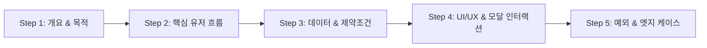

# 🎤 사용자 요구사항 도출 인터뷰 가이드 (Interview Guide)

이 문서는 `spec-planner` 에이전트가 사용자에게 친절하고 구조화된 대화를 통해 신규 기능의 요구사항을 수집하고, [FEATURE_SPEC_TEMPLATE.md](file:///C:/Users/admin/antigravity-workflow/docs/features/FEATURE_SPEC_TEMPLATE.md)에 필요한 모든 핵심 데이터를 완성도 높게 도출하기 위한 **단계별 인터뷰 프레임워크**입니다.

---

## 🧭 인터뷰 진행 5단계 (5-Step Interview Framework)

사용자가 복잡한 기술 용어를 몰라도 자연스럽게 답변할 수 있도록 일상적인 언어로 질문하되, 내부적으로는 개발 표준(Prisma 스키마, REST API, React 400줄 컴포넌트, QA TC)으로 매핑하여 정리합니다.



---

### 1단계: 기능 개요 및 목적 파악 (Background & Objective)
- **목적**: 기능의 존재 이유와 사용자 가치 정의
- **질문 예시**:
  - "이 기능을 추가하려는 핵심 배경이나 해결하고자 하는 문제가 무엇인가요?"
  - "이 기능이 도입되었을 때 사용자가 얻게 되는 가장 중요한 경험 1~2가지는 무엇일까요?"
  - "이 기능은 모든 사용자(일반 멤버)가 사용하나요, 아니면 관리자(Admin) 전용 기능인가요? 그리고 전역(Core) 기능인가요, 특정 워크스페이스 내에서만 동작하나요?"

---

### 2단계: 핵심 사용자 흐름 및 조작 시나리오 (User Journey)
- **목적**: 화면 진입부터 최종 액션까지의 단계별 흐름 파악
- **질문 예시**:
  - "사용자가 어느 화면/메뉴를 클릭해서 이 기능으로 진입하게 되나요?"
  - "진입한 후 사용자가 어떤 조작(예: 버튼 클릭, 드롭다운 선택, 폼 입력 등)을 순서대로 진행하게 되나요?"
  - "작업이 성공했을 때 화면에 어떤 변화(예: 새 항목이 목록에 추가, 토스트 메시지 노출, 모달 닫힘 등)가 일어나야 하나요?"

---

### 3단계: 저장될 데이터 및 비즈니스 제약조건 (Data & Validation)
- **목적**: Prisma 스키마 필드 및 REST API Request Body/DTO 도출
- **질문 예시**:
  - "이 기능을 위해 저장하거나 다루어야 하는 정보(데이터)는 어떤 것들이 있나요? (예: 제목, 상태, 일자, 첨부파일 등)"
  - "반드시 입력해야 하는 필수 항목과 선택적으로 입력해도 되는 항목은 무엇인가요?"
  - "중복 생성이 금지되어야 하는 항목이 있나요? (예: 동일 워크스페이스 내 중복 이름 불가 등)"
  - "상위 항목이 삭제될 때 이 데이터는 같이 삭제되어야 하나요, 아니면 보존되어야 하나요?"

---

### 4단계: UI/UX 배치 및 인터랙션 정책 (UI Architecture)
- **목적**: 400줄 이하 서브 컴포넌트 분할 및 모달/상태 관리 계획 수립
- **질문 예시**:
  - "화면은 어떤 구조로 구성하고 싶으신가요? (예: 상단 필터바/검색창 + 좌측 목록 + 우측 상세 영역)"
  - "등록/수정 작업은 별도의 독립 페이지에서 진행하나요, 아니면 팝업 모달/슬라이드 드로어 형태로 띄우나요?"
  - "화면에서 즉각적인 변경(드래그 앤 드롭, 토글 스위치 등)이 필요한 인터랙션 요소가 있나요?"
  - "다른 페이지에서도 공통으로 띄워야 하는 모달인가요, 이 페이지 전용 모달인가요?"

---

### 5단계: 예외 상황 및 엣지 케이스 (Edge Cases & QA)
- **목적**: Negative Test Cases 및 에러 처리 정책 도출
- **질문 예시**:
  - "사용자가 필수값을 비워두고 저장을 누르거나 잘못된 값을 입력했을 때 어떤 경고를 보여줄까요?"
  - "권한이 없는 사용자가 해당 URL로 직접 접근하거나 API를 호출했을 때 어떻게 차단할까요? (403 경고 토스트 후 이전 페이지 리다이렉트 등)"
  - "서버 장애나 네트워크 오류 등 예상치 못한 실패 시 사용자에게 어떤 안내를 제공할까요?"

---

## 📝 산출물 도출 및 검증 가이드
1. 인터뷰 답변을 취합하여 [FEATURE_SPEC_TEMPLATE.md](file:///C:/Users/admin/antigravity-workflow/docs/features/FEATURE_SPEC_TEMPLATE.md) 구조로 초안을 작성합니다.
2. 미처 사용자가 언급하지 않은 기술적 세부사항(타입, HTTP 상태 코드, 파일 분할 목록, Mock 데이터 샘플)은 아키텍처 표준([GEMINI.md](file:///C:/Users/admin/antigravity-workflow/GEMINI.md))에 따라 에이전트가 주도적으로 채워 넣습니다.
3. 기획서 저장: `docs/features/NN_[FEATURE_NAME]_SPECIFICATION.md` (`UTF-8 with BOM` 저장).
4. 유효성 검증 CLI 실행:
   ```powershell
   python .agents/skills/feature-spec-writer/scripts/spec_validator.py docs/features/NN_[FEATURE_NAME]_SPECIFICATION.md
   ```
5. 검증 통과 후 사용자에게 완성된 기획서 링크를 제시하고 최종 검토를 요청합니다.
