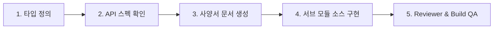

# ⚛️ React Component Developer Skill (`react-component-developer`)

AntiGravity Workflow 프론트엔드(`workflow_react/`) 기능 구현 및 컴포넌트 개발 표준 스킬입니다.
상세 코딩/스토어/모달/스토리지 컨벤션은 [`references/RULES.md`](file:///C:/Users/admin/antigravity-workflow/.agents/skills/react-component-developer/references/RULES.md)를 참조합니다.

---

## 📂 1. 표준 디렉토리 아키텍처

```text
workflow_react/src/
├── components/   # 도메인별 React UI 컴포넌트 (Max 400줄, common/ 및 {domain}/index.ts 배럴 필수)
├── pages/        # 순수 오케스트레이터 페이지 (Pure Orchestrator)
├── stores/       # Zustand 5.x 클라이언트 전역 상태 (use{Domain}Store.ts)
├── context/      # useContext 기반 정적 세션/테넌트 상태 (AuthContext, WorkspaceContext)
├── hooks/        # UI 인터랙션 및 공통 커스텀 훅
├── lib/          # 핵심 인프라 (apiClient, queryClient, prefRepository)
├── api/          # TanStack Query v5 훅 및 백엔드 REST API 통신 모듈
├── types/        # TypeScript DTO 및 데이터 모델 인터페이스 정의
└── utils/        # safeStorage, draftStorage 등 순수 유틸리티
```

---

## 📋 2. 5단계 기능 개발 파이프라인 및 지정 산출물



1. **1단계 (타입 정의)**: `src/types/{domain}.ts` 모델링.
2. **2단계 (API 확인)**: `docs/api/{domain}/` 명세 확인 (`api-spec-reader` 활용).
3. **3단계 (사양서 작성)**: `docs/components/{domain}_COMPONENTS.md` 작성 및 `docs/FRONTEND_SPECIFICATION.md` 동기화.
4. **4단계 (소스 구현)**:
   - `src/api/{domain}.ts` (TanStack Query 훅)
   - `src/components/{domain}/*` (Max 400줄 분할 컴포넌트 + `index.ts`)
   - `src/stores/use{Domain}Store.ts` (필요 시 Zustand 클라이언트 스토어)
   - `src/pages/{Domain}Page.tsx` (순수 오케스트레이터)
5. **5단계 (품질 검증)**: `python .agents/skills/react-component-reviewer/scripts/component_reviewer.py workflow_react/src` 및 `npm run build` 0 errors 검증.

---

## 🛠️ 3. 핵심 코딩 규칙 체크리스트

- [ ] **단일 컴포넌트 400줄 제한**: 비대해진 컴포넌트는 `src/components/{domain}/` 서브 컴포넌트로 분할 및 `index.ts` 배럴 필수.
- [ ] **Ghost State 금지**: `const [, setX] = useState(...)` 형태의 언팩 묵살 패턴 절대 금지.
- [ ] **모달 제어 2대 표준 (App.tsx Hoisting 금지)**:
  - **전역 모달**: `useUIStore.ts` 액션 + `<GlobalModalManager />` 마운트 (어디서든 단 1줄 호출).
  - **페이지 모달**: 해당 Page/컴포넌트 내 `useState` 선언(Colocation) + `ModalWrapper` 사용.
- [ ] **상태 분리**: DB 데이터는 TanStack Query, UI 전역은 Zustand, 정적 세션은 Context.
- [ ] **Zustand 구독 최적화**: `(state) => state.x` 개별 셀렉터 또는 `useShallow` 강제 (전체 비구조화 금지).
- [ ] **LocalStorage 안전 사용**: 키 접두사 `ag_` 강제, raw `localStorage` 직접 호출 금지 (`safeStorage` 또는 Zustand `persist` 활용).
