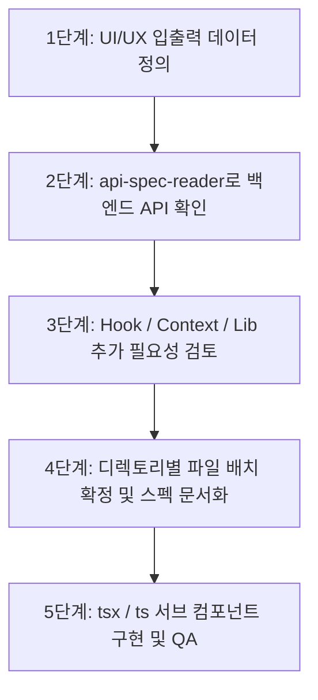

---
name: react-component-developer
description: React 컴포넌트, 페이지, 훅, 컨텍스트 및 라이브러리 개발 표준 절차(디렉토리 규격, API 스펙 분석, 기능 설계, 서브 컴포넌트 모듈화 구현)를 안내하는 전담 개발 스킬입니다.
---

# ⚛️ React Component Developer Skill (`react-component-developer`)

본 스킬은 AntiGravity Workflow 프론트엔드(`workflow_react/`)에서 새로운 UI/UX 기능을 개발하거나 컴포넌트를 확장할 때 준수해야 하는 **표준 디렉토리 규격**, **기능 설계 파이프라인(Design Pipeline)** 및 **컴포넌트 구현 표준**을 제공합니다.

---

## 📂 1. 표준 디렉토리 아키텍처 및 역할 정의

```text
workflow_react/src/
├── components/   # 실제 tsx 파일들로 이루어진 도메인별 React UI 컴포넌트
├── pages/        # 여러 컴포넌트를 조합하여 화면을 구성하는 레이아웃 및 순수 오케스트레이터
├── hooks/        # UI 기능, 액션 피드백 및 API 통신 전담 Custom React Hooks
├── context/      # useContext 등을 활용한 전역 세션/테넌트 상태 관리
├── lib/          # 여러 컴포넌트/훅에서 공통으로 사용되는 핵심 인프라 (apiClient, queryClient 등)
├── api/          # TanStack Query 훅 및 백엔드 REST API 통신 모듈
├── types/        # TypeScript DTO 및 데이터 모델 인터페이스 정의
└── utils/        # draftStorage(임시저장), 날짜/색상 포맷터 등 순수 유틸리티
```

### 디렉토리별 세부 책임
1. **`src/components/`**:
   - `common/`: 재사용 공통 UI (`Button`, `Card`, `Badge`, `ModalWrapper` 등).
   - `{domain}/` (`kanban/`, `issueDetail/`, `settings/`, `chat/` 등): 도메인 전담 컴포넌트.
   - **400줄 제한**: 단일 컴포넌트가 400줄을 초과하지 않도록 서브 컴포넌트(Sub-components)로 역할을 쪼개어 구성.
2. **`src/pages/`**:
   - React Router 진입점 페이지로, 복잡한 렌더링 JSX 대신 **서브 컴포넌트 배치 및 데이터 오케스트레이션(Pure Orchestrator)**만 전담.
3. **`src/hooks/`**:
   - UI 인터랙션, 모달 닫기, 액션 피드백(`useActionFeedback`), 데이터 가공 커스텀 훅.
4. **`src/context/`**:
   - 전역 상태(`AuthContext`, `WorkspaceContext`) 관리 및 로컬 즉시 동기화 메서드(`updateUserLocal` 등) 제공.
5. **`src/lib/`**:
   - `apiClient.ts` (Axios 인터셉터), `queryClient.ts` (TanStack Query 설정), `prefRepository.ts` (사용자 설정 저장소).

---

## 📋 2. 기능 설계 파이프라인 (Feature Design Pipeline)

새로운 컴포넌트나 화면을 개발할 때 반드시 다음 4단계 설계 프로세스를 거쳐 구현을 확정합니다.



### 단계별 상세 가이드
1. **1단계: UI/UX 입출력 데이터 정의 (I/O Definition)**:
   - 화면에 표시할 데이터 구조(Output)와 사용자가 입력/조작할 폼 데이터(Input)를 파악하고 `src/types/` 인터페이스로 정의합니다.
2. **2단계: 백엔드 API 연동 가능 여부 확인 (`api-spec-reader`)**:
   - `api-spec-reader` 스킬을 활용하여 `docs/api/` 또는 `api_inspector.py`로 관련 백엔드 엔드포인트(URL, Method, Request/Response 규격)가 존재하는지 확인합니다.
3. **3단계: 보조 모듈(Hook / Context / Lib) 개발 여부 판단**:
   - 새 API 호출을 위한 TanStack Query 훅(`src/api/{domain}.ts`), 전역 상태 변경 여부(`src/context/`), 공통 유틸/훅(`src/hooks/`)이 필요한지 결정합니다.
4. **4단계: 디렉토리별 파일 목록 확정 및 기능 설계 확정**:
   - 추가/수정할 `pages/`, `components/{domain}/`, `types/`, `api/` 파일 목록을 명확히 계획합니다.

---

## 🛠️ 3. 컴포넌트 구현 표준 및 코딩 규칙 (Implementation Standards)

1. **React 공식 권장 사양 준수**:
   - 함수형 컴포넌트 (`React.FC<Props>`) 및 엄격한 TypeScript Props 타이핑.
2. **서브 컴포넌트 모듈화 (Max 400줄)**:
   - 비대해진 단일 컴포넌트 금지, 기능 블록 단위로 `src/components/{domain}/` 하위 파일로 분할.
3. **Modal Colocation & Ghost State 금지**:
   - 모달/드로어는 해당 도메인 서브 컴포넌트 내부에 배치하거나 JSX 트리에 마운트 필수.
   - `const [, setX] = useState(...)` 형태의 언팩 린트 묵살 패턴 절대 금지.
4. **TanStack Query Smooth Cache Update**:
   - `placeholderData: (previousData) => previousData`로 깜빡임 제거.
   - `setQueriesData` In-place 즉시 갱신 및 불필요한 전체 리마운트(key 강제 변경) 지양.
5. **품질 검증 (QA & Build)**:
   - `react-component-reviewer` 스킬 실행 (0 errors).
   - `npm run build` 검증 (0 errors).
