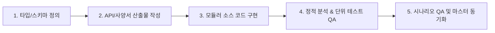

# 📌 AntiGravity Workflow System - Unified Agent Instructions

## 1. Project Context & Reference Architecture
이 프로젝트는 **이슈 및 일감 관리 시스템 (Issue & Task Management System)**의 풀스택 웹 애플리케이션입니다:
- **`workflow_server/`**: Node.js + Express + TypeScript + Prisma ORM 기반 백엔드 REST API
- **`workflow_react/`**: React 18 + TypeScript + Vite + TanStack Query 기반 프론트엔드 SPA

> **📖 상세 아키텍처 참조 (필요 시 선택적 열람)**:
> 세부 디렉토리 구조, 데이터 모델 및 설계 명세는 필요할 때 아래 전담 문서를 참조합니다.
> - **백엔드 아키텍처**: [`docs/BACKEND_ARCHITECTURE.md`](file:///C:/Users/admin/antigravity-workflow/docs/BACKEND_ARCHITECTURE.md)
> - **프론트엔드 아키텍처**: [`docs/FRONTEND_ARCHITECTURE.md`](file:///C:/Users/admin/antigravity-workflow/docs/FRONTEND_ARCHITECTURE.md)
> - **프론트엔드 컴포넌트 설계 명세**: [`docs/FRONTEND_SPECIFICATION.md`](file:///C:/Users/admin/antigravity-workflow/docs/FRONTEND_SPECIFICATION.md), [`docs/FRONTEND_DESIGN_SYSTEM.md`](file:///C:/Users/admin/antigravity-workflow/docs/FRONTEND_DESIGN_SYSTEM.md)
> - **REST API 도메인 명세**: [`docs/api/README.md`](file:///C:/Users/admin/antigravity-workflow/docs/api/README.md)

---

## 2. Core Development Standards

### 2.1 Backend Coding Standards (`workflow_server/`)
- **3-Tier Layered Architecture**: Routes (미들웨어 바인딩) ➔ Controllers (DTO 파싱/응답 직렬화) ➔ Sub-Services (순수 비즈니스 로직 및 Prisma 쿼리 전담, 30~50줄).
- **Strict JWT Verification**: 사용자 신원은 오직 암호 검증된 JWT Access Token (`jwt.verify` -> `payload.userId`)으로만 인지 (임의 `userId` 바디 입력 우회 인가 금지).
- **Subpath Imports**: 상대 경로 대신 `#lib/prisma.js` 등의 Path Alias 사용.

### 2.2 Frontend Coding Standards (`workflow_react/`)
- **Sub-Component Modular Architecture (Max 400줄)**: 거대 단일 컴포넌트 금지. 모든 대형 UI는 `src/components/{domain}/` 하위의 전담 서브 컴포넌트들로 역할을 분할하여 구성 (`index.ts` re-export 필수).
- **상태 관리 분리 원칙 (Server State vs Global Client State vs useContext)**:
  - **Server State**: DB/API 데이터는 반드시 TanStack Query v5 (`useQuery`, `useMutation`)로 관리 (`placeholderData`로 깜빡임 방지, `setQueriesData` In-place 갱신).
  - **Global Client State**: UI 전역 상태(모달, 사이드바, 필터, 뷰모드)는 **Zustand 5.x** 사용 (`src/stores/`). 비구조화 할당 금지, 셀렉터(`(state) => state.x`) 또는 `useShallow` 필수.
  - **Session Context**: 정적 세션/인증/테넌트(`AuthContext`, `WorkspaceContext`) 맥락만 **React Context (`useContext`)** 사용.
- **React Portal 기반 Popup/Modal 표준 (Modal Hoisting 금지)**:
  - 모든 모달/팝업은 부모의 CSS Stacking Context(`overflow: hidden`, `transform`, `z-index`) 탈출을 위해 **`Portal`** 또는 **`ModalWrapper`**를 사용하여 최상위 DOM(`ag-portal-root`)에 마운트.
  - **전역 모달**: 헤더/단축키/인터셉터 등 앱 전역에서 호출되는 모달(`AuthModal`, `IssueModal` 등)은 **Zustand `useUIStore` + `<GlobalModalManager />`**로 제어 (Props Drilling 0건).
  - **페이지 모달**: 특정 화면에 국한된 모달(`ProjectModal`, `SprintModal`, `ConfirmModal` 등)은 **해당 Page/컴포넌트 내부에 `useState` 선언(Colocation)**.
  - `App.tsx`에 모든 모달 State를 몰아넣는 안티패턴(Modal Hoisting) 엄격 금지.
  - ESC 키 닫기, 배경 클릭 감지, 배경 스크롤 락(`overflow: hidden`), 접근성(`role="dialog"`) 필수 및 Ghost State(`const [, setX] = useState(...)`) 절대 금지.
- **LocalStorage 안전 사용 원칙**:
  - Raw `localStorage` 직접 호출 금지. 네임스페이스 `ag_` 접두사 강제 (`ag_ui_state`, `ag_draft_*` 등).
  - 영속화 필요 시 Zustand `persist` 미들웨어 또는 `src/utils/safeStorage.ts` 유틸리티 활용.
- **Draft Persistence (`draftStorage.ts`)**: 600ms 디바운스 자동 임시 저장 및 페이지 재진입 시 복원 배너 제공.
- **Design Tokens**: CSS Variables 기반 다크 모던 테크(VS Code / Linear 스타일) 테마 및 색상 시스템 준수.

---

## 3. Sub-Service Unit Testing Standards (`src/tests/`)
1. **테스트 파일 위치**: `workflow_server/src/tests/` 하위 작성.
2. **Use-Case 검증**: Sub-Service 단위로 성공, 실패, 예외, 경계 조건 케이스를 포괄 검증.
3. **파일명 명명 규칙**: `{domain}.{service}.test.ts` (예: `src/tests/auth.jwtAuth.test.ts`, `src/tests/tags.getTags.test.ts`).

---

## 4. Language & File Encoding Standards
- **한국어 우선**: 모든 질의응답, 문서 및 설명은 한국어로 진행합니다.
- **UTF-8 with BOM**: 모든 소스 코드 및 마크다운 문서는 `UTF-8 with BOM` (`utf-8-sig`) 인코딩으로 저장합니다 (JSON 등 예외).
- **상단 coding 주석 금지**: 파일 첫 줄에 `// -*- coding: utf-8 -*-` 등의 불필요한 헤더를 작성하지 않습니다.
- **Clickable Links**: 파일 경로 언급 시 `[filename](file:///absolute/path/to/file)` 포맷을 준수합니다.

---

## 5. Operating Principles
1. **Self-Annealing Loop**: 오류 발생 시 원인 분석 ➔ 자동 정정 ➔ 테스트 검증 후 보고합니다.
2. **Modular Scalability**: 신규 기능 추가 시 거대 단일 파일 지양, `services/{action}.service.ts` 단위 파일 분할로 확장합니다.

---

## 6. Custom Agents & Skills Architecture
- **Agents (`.agents/agents/`)**:
  - `frontend-developer`: React 18 + Vite + TS + TanStack Query + Zustand 기반 프론트엔드 전담 개발자 에이전트. 기능 개발 파이프라인에 따라 사양서 문서(`docs/components/`)와 서브 컴포넌트 소스를 동반 생성하고, Zustand/Portal/LocalStorage 규칙 및 `react-component-reviewer` 스킬로 검증을 완수합니다.
  - `backend-developer`: Node.js + Express + TS + Prisma ORM 기반 백엔드 전담 개발자 에이전트. 백엔드 파이프라인에 따라 REST API 스펙 문서(`docs/api/`)와 3-Tier 서브 서비스 및 Vitest 단위 테스트를 동반 생성합니다.
  - `api-viewer`: `docs/api/` 및 백엔드 도메인 소스(`workflow_server/src/modules/`)를 분석하여 API 설명, DTO 규격 및 프론트/백 연계 지원을 전담하는 뷰어 에이전트.
  - `qa-tester`: 프론트엔드 UI/UX 조작과 백엔드 REST API 연동을 결합한 통합 시나리오 테스트(E2E / 시나리오 검증)를 수행하고, 정상(Positive) 및 의도된 에러 검증(Negative TC)을 포괄하는 테스트 케이스를 설계/관리하는 전담 QA 테스터 에이전트.
- **Skills (`.agents/skills/`)**:
  - `react-component-developer`: 컴포넌트/페이지/상태관리(Zustand, useContext, Portal Popup, LocalStorage) 개발 표준 파이프라인을 가이드하며 지정된 사양서 산출물(`docs/components/*.md`)과 모듈화 소스 생성을 표준화하는 전담 개발 스킬.
  - `react-component-reviewer`: 컴포넌트 모듈화(400줄 제한), React Portal 기반 팝업 격리, 모달 Colocation, Ghost State 누락 및 LocalStorage 안전성을 정적 분석하고 검증하는 품질 보증(QA) 스킬.
  - `api-spec-reader`: `docs/api/` 폴더를 실시간 스캔(Auto-Discovery)하고 `api_inspector.py`를 통해 REST API 엔드포인트/도메인 정보를 핀포인트로 조회/검색하는 실행 기술(Skill).
  - `scenario-qa-runner`: UI/UX 조작과 실제 API를 연동한 포괄적 시나리오 TC 작성 및 풀스택 회귀 검증(`qa_runner.py`)을 전담하는 QA 실행 기술(Skill).

---

## 7. Standard Development Pipeline & Mandatory Deliverables (개발 파이프라인 및 지정 산출물 표준)

모든 신규 기능 추가 또는 변경 작업 시, 에이전트와 스킬은 반드시 아래 파이프라인을 따라 **지정된 산출물(Documents)과 소스 코드(Source Codes)**를 작성합니다.

### 프론트엔드 파이프라인 및 지정 산출물
1. **타입 정의**: `workflow_react/src/types/{domain}.ts` 모델 정의.
2. **사양서 문서 산출물**: `docs/components/{domain}_COMPONENTS.md` 작성 (Props, State, 컴포넌트 계층도, API 매핑).
3. **소스 코드 구현**: `src/api/{domain}.ts`, `src/components/{domain}/*` (Max 400줄 + `index.ts`), `src/stores/use{Domain}Store.ts` (필요 시 Zustand 클라이언트 스토어), `src/pages/{Domain}Page.tsx` (순수 오케스트레이터).
4. **품질 검증 (QA)**: `python .agents/skills/react-component-reviewer/scripts/component_reviewer.py workflow_react/src` (0 errors) 및 `npm run build` 통과.
5. **마스터 동기화**: `docs/FRONTEND_SPECIFICATION.md` 인덱스 업데이트.

### 백엔드 파이프라인 및 지정 산출물
1. **API 스펙 산출물**: `docs/api/{domain}/{action}.md` (HTTP Method, URL, Body, Response 스펙).
2. **DB 스키마/DTO**: `prisma/schema.workspace.prisma`, `src/modules/{domain}/dto/*.dto.ts`.
3. **소스 코드 구현**: `src/modules/{domain}/{domain}.routes.ts`, `*.controller.ts`, `services/*.service.ts` (30~50줄).
4. **단위 테스트 (QA)**: `src/tests/{domain}.{service}.test.ts` (Vitest 100% Pass).
5. **마스터 동기화**: `docs/api/README.md` 인덱스 업데이트.

### QA & 시나리오 테스트 파이프라인 및 지정 산출물
1. **시나리오 TC 산출물**: `docs/qa/scenarios/{domain}.md` (Positive, Negative, Data Integrity 테스트 케이스 매트릭스).
2. **풀스택 회귀 검증**: `python .agents/skills/scenario-qa-runner/scripts/qa_runner.py --run-all` (All Pass).
3. **마스터 동기화**: `docs/qa/README.md` 인덱스 업데이트.
