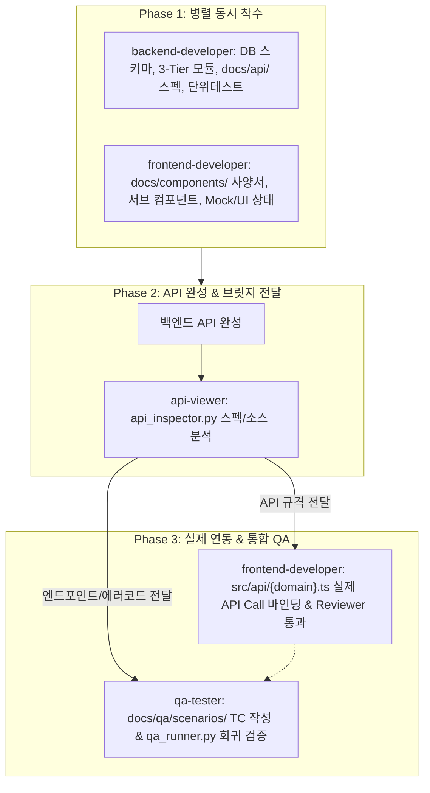

# 📌 Full-Stack Web Application - Unified Agent Instructions

## 1. Reference Architecture
- **Backend (`server/` 또는 `workflow_server/`)**: Node.js + Express + TypeScript + Prisma ORM (REST API)
- **Frontend (`client/` 또는 `workflow_react/`)**: React 18 + TypeScript + Vite + TanStack Query (SPA)

---

## 2. Core Development Standards

### 2.1 Backend Standards
- **3-Tier Layered**: Routes ➔ Controllers ➔ Sub-Services (순수 비즈니스/Prisma 쿼리 전담, 30~50줄).
- **Strict JWT**: 신원은 암호 검증된 Access Token(`jwt.verify` -> `payload.userId`)으로만 인지.
- **Subpath Imports**: `#lib/prisma.js` 등 Path Alias 사용.

### 2.2 Frontend Standards
- **Sub-Component Modular (Max 400줄)**: 대형 UI는 `src/components/{domain}/` 전담 서브 컴포넌트로 분할 (`index.ts` 필수).
- **상태 관리 분리**:
  - Server State: TanStack Query v5 (`useQuery`, `useMutation`, `placeholderData`, `setQueriesData`).
  - Global Client State: Zustand 5.x (`src/stores/`, 개별 셀렉터 또는 `useShallow` 필수).
  - Session Context: 정적 인증/테넌트만 React Context (`useContext`) 사용.
- **Modal/Popup 표준 (Modal Hoisting 금지)**:
  - 전역 모달: `useUIStore` + `<GlobalModalManager />` (Portal).
  - 페이지 모달: 해당 컴포넌트 내 `useState` (Colocation) + `ModalWrapper` (Portal).
  - Ghost State(`const [, setX] = useState(...)`) 금지, `role="dialog"`, ESC 닫기, 스크롤 락 필수.
- **LocalStorage**: 네임스페이스 접두사 강제(예: `app_`, `ag_`), `safeStorage.ts` 또는 Zustand `persist` 사용 (raw 직접 호출 금지).

---

## 3. Sub-Service Unit Testing Standards
- 파일 위치: `src/tests/{domain}.{service}.test.ts`
- 성공, 실패, 경계 조건 단위 테스트 작성 및 `npm test` 100% Pass.

---

## 4. Language & File Encoding Standards
- 한국어 우선, UTF-8 with BOM (`utf-8-sig`) 저장 (JSON 제외).
- 파일 링크: `[filename](file:///absolute/path/to/file)` 형식 준수.
- 상단 coding 주석(`// -*- coding: utf-8 -*-`) 금지.

---

## 5. Agents & Skills Architecture
- **Agents (`.agents/agents/`)**:
  - `frontend-developer`: React 18 모듈러 컴포넌트, Zustand, TanStack Query, 사양서 및 UI 구현.
  - `backend-developer`: Express, Prisma 3-Tier 모듈, REST API 스펙 및 단위 테스트 구현.
  - `api-viewer`: 완성된 백엔드 API/소스를 분석하여 `frontend-developer`와 `qa-tester`에게 규격을 전달하는 브릿지 허브.
  - `qa-tester`: UI-API 통합 시나리오 TC(Positive/Negative) 작성 및 풀스택 회귀 테스트 전담.
- **Skills (`.agents/skills/`)**:
  - `api-spec-reader`: `docs/api/` 및 소스 실시간 스캔 CLI (`api_inspector.py`).
  - `react-component-developer`: React 컴포넌트/상태 표준 개발 파이프라인.
  - `react-component-reviewer`: 컴포넌트 정적 분석기 (`component_reviewer.py`, 400줄/Ghost State/Portal/Storage 검사).
  - `scenario-qa-runner`: 풀스택 통합 회귀 테스트 실행기 (`qa_runner.py`).

---

## 6. Concurrent & API-Viewer Bridge Pipeline (개발 파이프라인 및 산출물)

기능 개발 시 프론트엔드와 백엔드가 병렬로 동시 착수하며, API 완성 후 `api-viewer`가 규격을 전달하여 실제 연동 및 QA를 완성합니다.

### 단계별 지정 산출물
1. **Phase 1 (병렬 착수)**:
   - Backend: `docs/api/{domain}/{action}.md`, `prisma/schema.prisma` (또는 프로젝트 스키마), `src/modules/{domain}/*`, `src/tests/*.test.ts`.
   - Frontend: `docs/components/{domain}_COMPONENTS.md`, `src/components/{domain}/*` (Max 400줄 + `index.ts`), UI 상태/스토어.
2. **Phase 2 (브릿지 전달)**:
   - `api-viewer`가 `docs/api/` 및 서버 소스를 검증 후 `frontend-developer`와 `qa-tester`에게 DTO 및 엔드포인트 규격 인계.
3. **Phase 3 (실제 연동 & QA)**:
   - Frontend: `src/api/{domain}.ts` (TanStack Query 훅 실제 바인딩), `component_reviewer.py` 0 errors, `npm run build` 통과.
   - QA: `docs/qa/scenarios/{domain}.md` (Positive/Negative TC), `python .agents/skills/scenario-qa-runner/scripts/qa_runner.py --run-all` 통과.
   - 마스터 인덱스 동기화: `docs/api/README.md`, `docs/FRONTEND_SPECIFICATION.md`, `docs/qa/README.md`.
