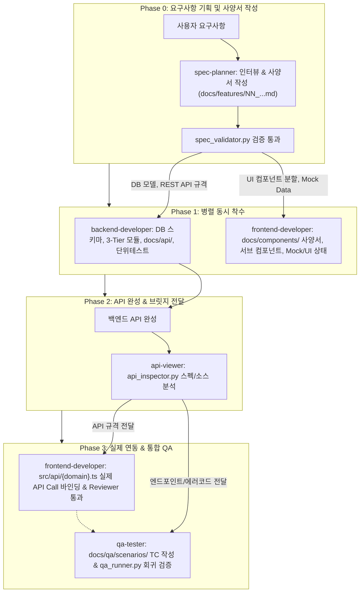

# 📌 Full-Stack Web Application - Unified Agent Instructions

## 1. Reference Architecture
- **Backend (`server/` 또는 `workflow_server/`)**: Node.js + Express + TypeScript + Prisma ORM (REST API)
- **Frontend (`client/` 또는 `workflow_react/`)**: React 18 + TypeScript + Vite + TanStack Query (SPA)

---

## 2. Core Development Standards

### 2.1 Backend Standards
- **3-Tier Layered**: Routes ➔ Controllers ➔ Sub-Services (순수 비즈니스/Prisma 쿼리 전담, 30~50줄).
- **Strict JWT**: 신원은 암호 검증된 Access Token(`jwt.verify` -> `payload.userId`)으로만 인지.
- **Subpath Imports**: `#lib/prisma.js` 등 Path Alias 사용.

### 2.2 Frontend Standards
- **Sub-Component Modular (Max 400줄)**: 대형 UI는 `src/components/{domain}/` 전담 서브 컴포넌트로 분할 (`index.ts` 필수).
- **상태 관리 분리**:
  - Server State: TanStack Query v5 (`useQuery`, `useMutation`, `placeholderData`, `setQueriesData`).
  - Global Client State: Zustand 5.x (`src/stores/`, 개별 셀렉터 또는 `useShallow` 필수).
  - Session Context: 정적 인증/테넌트만 React Context (`useContext`) 사용.
- **Modal/Popup 표준 (Modal Hoisting 금지)**:
  - 전역 모달: `useUIStore` + `<GlobalModalManager />` (Portal).
  - 페이지 모달: 해당 컴포넌트 내 `useState` (Colocation) + `ModalWrapper` (Portal).
  - Ghost State(`const [, setX] = useState(...)`) 금지, `role="dialog"`, ESC 닫기, 스크롤 락 필수.
- **LocalStorage**: 네임스페이스 접두사 강제(예: `app_`, `ag_`), `safeStorage.ts` 또는 Zustand `persist` 사용 (raw 직접 호출 금지).
- **CSS Design Tokens & Theme Standards (테마 및 CSS 표준)**:
  - 색상 하드코딩(`#1e1e1e`, `#252526`, `#2d2d2d`, `#ffffff` 등) 금지. 반드시 `src/styles/theme.css`의 시맨틱 CSS 변수(`var(--bg-card)`, `var(--bg-dark)`, `var(--text-main)`, `var(--border-light)` 등) 사용.
  - Light 테마 / Dark 테마 양방향 시각적 가독성 및 명도 대비 준수.
  - 테마 상태는 `usePrefStore`의 `theme`('dark' | 'light' | 'system')으로 관리하며 `document.documentElement[data-theme]`와 실시간 연동.
- **CSS Modules (`*.module.css`) 작성 및 테마 색상 분리 원칙**:
  - `*.module.css` 내 테마 고정 색상(hex, rgb 고정값) 작성 절대 금지. 모듈 CSS는 레이아웃, 크기, 마진/패딩, Flex/Grid 등 '구조와 배치(Layout & Structure)'만 전담.
  - 색상이 필요한 경우 반드시 전역 CSS 변수(`var(--bg-card)`, `var(--text-main)` 등)를 참조하여 선언. 색상이 컴포넌트 모듈에 하드코딩되어 고정되는 현상을 원천 방지함.
- **태그 인라인 스타일(`style={{ ... }}`) 및 Tailwind 색상 직접 하드코딩 금지 원칙**:
  - JSX 태그 내 인라인 `style={{ ... }}`에 실제 색상 코드(`color: '#2d2d2d'`, `background: '#1e1e1e'`, `rgb(...)`, `rgba(...)`) 직접 입력 절대 금지.
  - Tailwind CSS 임의 값 색상 클래스(`bg-[#...]`, `text-[#...]`, `border-[#...]` 등) 사용 절대 금지.
  - 모든 색상 및 테마 관련 스타일은 반드시 `src/styles/theme.css`의 시맨틱 CSS 변수(`var(--bg-card)`, `var(--bg-main)`, `var(--bg-subtle)`, `var(--border-light)`, `var(--text-main)`, `var(--text-muted)` 등)를 바인딩하여 Light/Dark 테마 양방향 완벽 호환성을 보장해야 함.

---

## 3. Sub-Service Unit Testing Standards
- 파일 위치: `src/tests/{domain}.{service}.test.ts`
- 성공, 실패, 경계 조건 단위 테스트 작성 및 `npm test` 100% Pass.

---

## 4. Language & File Encoding Standards
- 한국어 우선, UTF-8 with BOM (`utf-8-sig`) 저장 (JSON 제외).
- 파일 링크: `[filename](file:///absolute/path/to/file)` 형식 준수.
- 상단 coding 주석(`// -*- coding: utf-8 -*-`) 금지.

---

## 5. Agents & Skills Architecture
- **Agents (`.agents/agents/`)**:
  - `spec-planner`: 사용자 인터뷰를 통해 요구사항을 수집하고 `docs/features/` 표준 기획 사양서를 작성/검증하는 기획 에이전트.
  - `frontend-developer`: React 18 모듈러 컴포넌트, Zustand, TanStack Query, 사양서 및 UI 구현.
  - `backend-developer`: Express, Prisma 3-Tier 모듈, REST API 스펙 및 단위 테스트 구현.
  - `api-viewer`: 완성된 백엔드 API/소스를 분석하여 `frontend-developer`와 `qa-tester`에게 규격을 전달하는 브릿지 허브.
  - `qa-tester`: UI-API 통합 시나리오 TC(Positive/Negative) 작성 및 풀스택 회귀 테스트 전담.
- **Skills (`.agents/skills/`)**:
  - `feature-spec-writer`: 사용자 인터뷰 프레임워크 및 기획 사양서 검증기 (`spec_validator.py`).
  - `api-spec-reader`: `docs/api/` 및 소스 실시간 스캔 CLI (`api_inspector.py`).
  - `react-component-developer`: React 컴포넌트/상태 표준 개발 파이프라인.
  - `react-component-reviewer`: 컴포넌트 정적 분석기 (`component_reviewer.py`, 400줄/Ghost State/Portal/Storage 검사).
  - `scenario-qa-runner`: 풀스택 통합 회귀 테스트 실행기 (`qa_runner.py`).

---

## 6. End-to-End Specification-to-QA Pipeline (개발 파이프라인 및 산출물)

기능 기획부터 병렬 착수, 브릿지 인계, 실제 연동 및 QA까지 이어지는 표준 워크플로우입니다.

```mermaid
flowchart TD
    subgraph Phase0 [Phase 0: 요구사항 기획 및 사양서 작성]
        USER["사용자 요구사항"] --> PLANNER["spec-planner: 인터뷰 & 사양서 작성 (docs/features/NN_...md)"]
        PLANNER --> VALID["spec_validator.py 검증 통과"]
    end

    subgraph Phase1 [Phase 1: 병렬 동시 착수]
        VALID -->|DB 모델, REST API 규격| BE_DEV["backend-developer: DB 스키마, 3-Tier 모듈, docs/api/, 단위테스트"]
        VALID -->|UI 컴포넌트 분할, Mock Data| FE_DEV["frontend-developer: docs/components/ 사양서, 서브 컴포넌트, Mock/UI 상태"]
    end

    subgraph Phase2 [Phase 2: API 완성 & 브릿지 전달]
        BE_DEV --> BE_DONE["백엔드 API 완성"]
        BE_DONE --> VIEWER["api-viewer: api_inspector.py 스펙/소스 분석"]
    end

    subgraph Phase3 [Phase 3: 실제 연동 & 통합 QA]
        VIEWER -->|API 규격 전달| FE_CALL["frontend-developer: src/api/{domain}.ts 실제 API Call 바인딩 & Reviewer 통과"]
        VIEWER -->|엔드포인트/에러코드 전달| QA_TEST["qa-tester: docs/qa/scenarios/ TC 작성 & qa_runner.py 회귀 검증"]
        FE_CALL -.-> QA_TEST
    end

    Phase0 --> Phase1
    Phase1 --> Phase2
    Phase2 --> Phase3
```

### 단계별 지정 산출물
0. **Phase 0 (기획 및 사양서)**:
   - Planner: `docs/features/NN_[FEATURE_NAME]_SPECIFICATION.md` 작성 및 `python .agents/skills/feature-spec-writer/scripts/spec_validator.py docs/features/NN_*.md` 통과.
1. **Phase 1 (병렬 착수)**:
   - Backend: `docs/api/{domain}/{action}.md`, `prisma/schema.prisma` (또는 프로젝트 스키마), `src/modules/{domain}/*`, `src/tests/*.test.ts`.
   - Frontend: `docs/components/{domain}_COMPONENTS.md`, `src/components/{domain}/*` (Max 400줄 + `index.ts`), UI 상태/스토어.
2. **Phase 2 (브릿지 전달)**:
   - `api-viewer`가 `docs/api/` 및 서버 소스를 검증 후 `frontend-developer`와 `qa-tester`에게 DTO 및 엔드포인트 규격 인계.
3. **Phase 3 (실제 연동 & QA)**:
   - Frontend: `src/api/{domain}.ts` (TanStack Query 훅 실제 바인딩), `component_reviewer.py` 0 errors, `npm run build` 통과.
   - QA: `docs/qa/scenarios/{domain}.md` (Positive/Negative TC), `python .agents/skills/scenario-qa-runner/scripts/qa_runner.py --run-all` 통과.
   - 마스터 인덱스 동기화: `docs/api/README.md`, `docs/FRONTEND_SPECIFICATION.md`, `docs/qa/README.md`.
