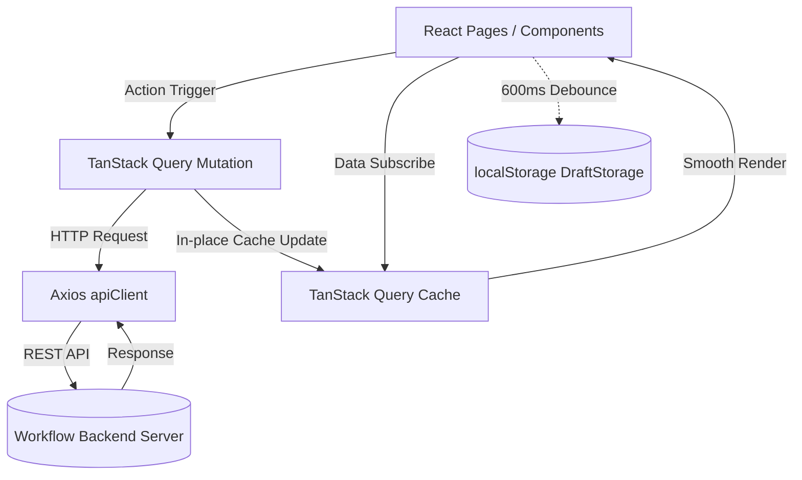

// -*- coding: utf-8 -*-
# 🏗️ AntiGravity Frontend Architecture (프론트엔드 구조 및 아키텍처)

## 1. 기술 스택 (Tech Stack)
- **Core**: React 18 (TypeScript), Vite
- **Server State & Caching**: TanStack Query (React Query v5)
- **HTTP Client**: Axios
- **Icons**: Lucide React
- **Styling**: CSS Variables + Dark Modern Glassmorphism System

---

## 2. 디렉토리 구조 (Directory Structure)

```text
workflow_react/src/
├── api/                    # TanStack Query 훅 및 원시 REST API 모듈
│   ├── auth.ts             # 인증/로그인/회원가입 쿼리 & 뮤테이션
│   ├── issues.ts           # 이슈 CRUD, 드래그 상태 변경, 좋아요
│   ├── projects.ts         # 프로젝트 CRUD 및 멤버 관리
│   ├── tags.ts             # 해시태그 목록/생성/삭제
│   ├── sprints.ts          # 스프린트 관리
│   ├── comments.ts         # 댓글/대댓글 트리 및 반응
│   ├── worklogs.ts         # 작업 시간(Worklog) 기록
│   ├── groups.ts           # 조직/부서 계층 관리
│   ├── favorites.ts        # 즐겨찾기 상태
│   └── index.ts            # API 모듈 Re-export
├── components/             # UI 컴포넌트 계층
│   ├── common/             # 재사용 가능한 공통 컴포넌트 (Button, Card, Badges, TagInput, Modal 등)
│   ├── kanban/             # 칸반 보드 (Board, Column, Card, FilterBar)
│   ├── issueDetail/        # 이슈 상세 드로어 및 메인 카드/에디터/댓글/작업로그
│   ├── chat/               # 실시간 채팅 채널/메시지/반응 컴포넌트
│   ├── dashboard/          # 대시보드 위젯 및 요약 차트
│   ├── layout/             # Header, Sidebar, Navigation 레이아웃
│   ├── IssueModal.tsx      # 신규 이슈 생성 및 팝업 모달
│   └── ProjectModal.tsx    # 신규 프로젝트 생성 모달
├── context/                # 전역 React Context (AuthContext, WorkspaceContext 등)
├── hooks/                  # 공통 커스텀 훅 (useActionFeedback, useOverlayClickClose 등)
├── lib/                    # apiClient, queryClient, preference 레포지토리
├── pages/                  # 라우트 진입점 페이지 (DashboardPage, IssuesPage, SprintsPage 등)
├── types/                  # 전역 TypeScript 인터페이스 & DTO 정의
└── utils/                  # 날짜 포맷, 댓글 트리, 임시저장소(draftStorage), 상태 색상 매퍼
```

---

## 3. 데이터 흐름 및 상태 관리 원칙



1. **Server State (TanStack Query)**:
   - 서버 데이터의 Single Source of Truth 관리.
   - 키 팩토리 패턴 (`issueKeys`, `projectKeys`, `tagKeys` 등)을 통한 정밀 캐시 무효화 및 메모리 내 즉시 갱신(`setQueriesData`).
2. **Global Client State (Context API)**:
   - `AuthContext`: 현재 로그인 유저 세션, 토큰 유지 및 갱신.
   - `WorkspaceContext`: 활성화된 테넌트 워크스페이스 컨텍스트.
3. **Local Draft Persistence (`draftStorage.ts`)**:
   - 이슈/프로젝트 작성 및 수정 중 이탈 시 작업 내용 보호를 위해 `localStorage`에 자동 디바운스 백업.
