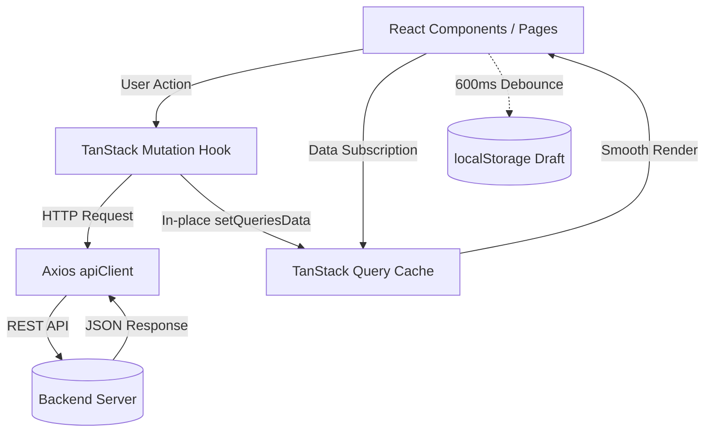

# 🏛️ AntiGravity Workflow System - Frontend Architecture

## 1. System Overview & Technology Stack

본 문서는 **AntiGravity Workflow Frontend (`workflow_react/`)**의 시스템 아키텍처 및 세부 설계 지침서입니다.

- **Core**: React 18 + TypeScript + Vite
- **Server State & Caching**: TanStack Query (React Query v5)
- **HTTP Client**: Axios (`apiClient`)
- **Styling**: CSS Variables + Dark Modern Tech (VS Code / Linear) Glassmorphism System
- **Realtime**: Socket.IO Client
- **Icons**: Lucide React

```text
[AntiGravity Workflow Frontend Architecture]
 └── 🌐 Client Layer (workflow_react/):
      ├── 🚀 Entry & Routing: main.tsx, App.tsx, react-router-dom
      ├── 🛡️ Contexts: AuthContext (세션), WorkspaceContext (테넌트)
      ├── 📡 API & Query Hooks: TanStack Query v5 기반 도메인별 훅 계층
      ├── 🧩 Components: 
      │    ├── common/ (Button, TagBadge, TagInput, ModalWrapper)
      │    ├── kanban/ (Board, Column, Card, FilterBar)
      │    ├── issueDetail/ (Drawer, EditForm, Comments, Worklogs)
      │    └── chat/ (Channels, Messages, Reactions)
      ├── 💾 Persistence: localStorage 기반 draftStorage (600ms 디바운스)
      └── 🎨 Design Tokens: CSS Variables 색상 시스템 & 다크 테마
```

---

## 2. Directory Structure & Layer Responsibilities

```text
workflow_react/src/
├── api/                    # TanStack Query 훅 및 REST API 통신 모듈
│   ├── auth.ts             # 로그인, 회원가입, 세션 조회
│   ├── issues.ts           # 이슈 CRUD, 드래그 상태 변경, 좋아요 토글
│   ├── projects.ts         # 프로젝트 CRUD, 멤버/부서 연동
│   ├── tags.ts             # 해시태그 목록/추천/생성/삭제
│   ├── sprints.ts          # 스프린트 관리 및 이슈 할당
│   ├── comments.ts         # 댓글/대댓글 트리 및 이모지 반응
│   ├── chat.ts             # 채팅 채널, 메시지 송수신
│   ├── workspaces.ts       # 워크스페이스 목록, 초대 가입
│   └── index.ts            # API 및 훅 Re-export
├── components/             # 프레젠테이션 & 컨테이너 UI 컴포넌트
│   ├── common/             # Button, Badge, TagBadge, TagInput, ModalWrapper 등
│   ├── kanban/             # KanbanBoard, KanbanColumn, KanbanCard, KanbanFilterBar
│   ├── issueDetail/        # IssueDetailDrawer, IssueDetailEditForm, IssueDetailView
│   ├── chat/               # ChatDrawer, ChannelList, MessageItem, EmojiPicker
│   ├── dashboard/          # 통계 위젯, 최근 이슈 요약, 진척률 차트
│   ├── layout/             # Header, Sidebar, Navigation
│   ├── IssueModal.tsx      # 이슈 생성/팝업 모달
│   └── ProjectModal.tsx    # 프로젝트 생성 모달
├── context/                # 전역 React Context (AuthContext, WorkspaceContext)
├── hooks/                  # 공통 커스텀 훅 (useActionFeedback, useOverlayClickClose)
├── lib/                    # apiClient(Axios 인터셉터), queryClient(TanStack)
├── pages/                  # 라우트 진입점 페이지 (DashboardPage, IssuesPage 등)
├── types/                  # 전역 TypeScript 모델 & DTO 인터페이스 정의
└── utils/                  # draftStorage(임시저장), 날짜 포맷, 태그 색상 헬퍼
```

---

## 3. Data Flow & State Management Principles



### 3.1 Server State (TanStack Query v5)
1. **깜빡임 없는 부드러운 렌더링 (Smooth Transitions)**:
   - `placeholderData: (previousData) => previousData`를 적용하여 쿼리 키 변경 시에도 빈 화면/스피너 노출 없이 이전 데이터를 유지하며 자연스럽게 전환합니다.
2. **In-place 캐시 즉시 갱신 (Optimistic Updates)**:
   - 데이터 생성/수정/삭제 시 전체 목록을 재요청(Refetch)하기 전 `queryClient.setQueriesData`를 통해 캐시를 즉시 부분 갱신합니다.
3. **불필요한 전체 리마운트 지양**:
   - 컴포넌트에 강제 `key`를 부여하여 화면 전체를 깜빡이며 리마운트하는 패턴을 금지하고, React 내부 상태로 스무스하게 갱신합니다.

### 3.2 Draft Persistence (`draftStorage.ts`)
- 이슈/프로젝트 생성 모달 및 수정 드로어에서 사용자가 작성 중인 폼 데이터를 600ms 디바운스로 `localStorage`에 자동 백업합니다.
- 페이지 이탈 후 재진입 시 복원 배너를 노출하여 작업 손실을 방지합니다.

---

## 4. UI/UX Design System & Token Integration

- **Visual Theme**: VS Code / Linear 스타일의 딥 다크 모던 테마.
- **CSS Variables**: `--primary`, `--bg-main`, `--bg-card`, `--border-light`, `--text-bright` 등 표준 변수 사용.
- **Micro-Interactions**: 호버 글로우, 반투명 글래스모피즘, 부드러운 토글 애니메이션.

---

## 5. Development & Build Standards

- **TypeScript Strict Mode**: 컴포넌트 Props 및 DTO 인터페이스 타입 강제.
- **Build Verification**: 수정 후 반드시 `npm run build` (`tsc -b && vite build`) 검증 (`0 errors`).
- **File Encoding**: 모든 소스 코드 및 문서는 `UTF-8 with BOM` (`utf-8-sig`) 저장.
