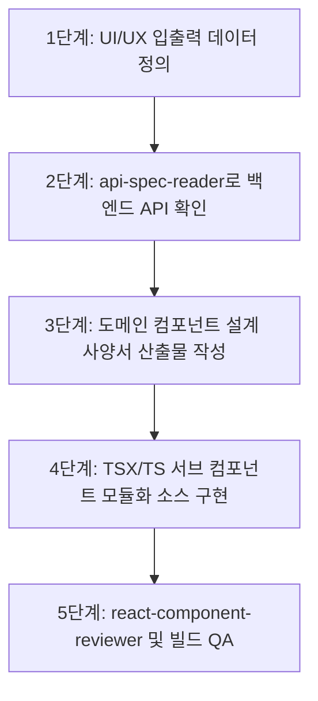

# 🏛️ AntiGravity Workflow System - Frontend Architecture

## 1. System Overview & Technology Stack

본 문서는 **AntiGravity Workflow Frontend (`workflow_react/`)**의 시스템 아키텍처, 디렉토리 구조 및 컴포넌트 개발 파이프라인 지침서입니다.

- **Core**: React 18 + TypeScript + Vite
- **Server State & Caching**: TanStack Query (React Query v5)
- **HTTP Client**: Axios (`apiClient`)
- **Styling**: CSS Variables + Dark Modern Tech (VS Code / Linear) Glassmorphism System
- **Realtime**: Socket.IO Client
- **Quality & Review**: `react-component-reviewer` 스킬을 통한 모듈화/안전성 자동 검증

```text
[AntiGravity Workflow Frontend Architecture]
 └── 🌐 Client Layer (workflow_react/):
      ├── 🚀 Entry & Routing: main.tsx, App.tsx, react-router-dom
      ├── 🛡️ Contexts: AuthContext (세션), WorkspaceContext (테넌트)
      ├── 📡 API & Query Hooks: TanStack Query v5 기반 도메인별 훅 계층
      ├── 🧩 Modular Sub-Components: 
      │    ├── common/ (Button, TagBadge, TagInput, ModalWrapper)
      │    ├── kanban/ (Board, Column, Card, FilterBar)
      │    ├── issueDetail/ (Drawer, EditForm, Comments, Worklogs)
      │    ├── settings/ (ProfileTab, OrgTab, SystemTab, WorkspaceTab)
      │    └── chat/ (Channels, Messages, Reactions)
      ├── 💾 Persistence: localStorage 기반 draftStorage (600ms 디바운스)
      └── 🎨 Design Tokens: CSS Variables 색상 시스템 & 다크 테마
```

---

## 2. Directory Structure & Layer Responsibilities

```text
workflow_react/src/
├── api/                    # TanStack Query 훅 및 REST API 통신 모듈
├── components/             # 프레젠테이션 & 컨테이너 UI 컴포넌트
│   ├── common/             # Button, Badge, TagBadge, TagInput, ModalWrapper 등
│   ├── kanban/             # KanbanBoard, KanbanColumn, KanbanCard, KanbanFilterBar
│   ├── issueDetail/        # IssueDetailDrawer, IssueDetailEditForm, IssueDetailView
│   ├── settings/           # SettingsProfileTab, SettingsOrgTab, SettingsSystemTab 등
│   ├── chat/               # ChatDrawer, ChannelList, MessageItem, EmojiPicker
│   ├── dashboard/          # 통계 위젯, 최근 이슈 요약, 진척률 차트
│   └── layout/             # Header, Sidebar, Navigation
├── context/                # 전역 React Context (AuthContext, WorkspaceContext)
├── hooks/                  # 공통 커스텀 훅 (useActionFeedback, useOverlayClickClose)
├── lib/                    # apiClient(Axios 인터셉터), queryClient(TanStack)
├── pages/                  # 순수 오케스트레이터 페이지 (DashboardPage, IssuesPage 등)
├── types/                  # 전역 TypeScript 모델 & DTO 인터페이스 정의
└── utils/                  # draftStorage(임시저장), 날짜 포맷, 태그 색상 헬퍼
```

---

## 3. 5-Step Feature Development Pipeline & Mandatory Deliverables

모든 신규 기능 추가 또는 컴포넌트 확장 시 `frontend-developer` 에이전트와 `react-component-developer` 스킬은 반드시 아래 5단계 파이프라인을 거쳐 **지정된 산출물과 소스 코드**를 생성합니다.



### 단계별 지정 산출물 매핑
1. **1단계 (I/O 모델링)**: `src/types/{domain}.ts` 인터페이스 작성.
2. **2단계 (API 확인)**: `docs/api/{domain}/` 명세 확인 (`api-spec-reader` 스킬).
3. **3단계 (설계 사양서)**: `docs/components/{domain}_COMPONENTS.md` 작성 및 `docs/FRONTEND_SPECIFICATION.md` 인덱스 갱신.
4. **4단계 (소스 구현)**: `src/api/{domain}.ts`, `src/components/{domain}/*` (Max 400줄 분할 + `index.ts`), `src/pages/{Domain}Page.tsx` (순수 오케스트레이터).
5. **5단계 (품질 검증)**: `python .agents/skills/react-component-reviewer/scripts/component_reviewer.py workflow_react/src` (0 errors) 및 `npm run build` 검증.

---

## 4. Sub-Component Modular Architecture & Safety Standards

1. **대규모 단일 컴포넌트 금지 (Max 400줄)**: 모든 대형 UI는 `src/components/{domain}/` 하위의 전담 서브 컴포넌트로 역할을 분할하고 `index.ts`로 re-export.
2. **Modal Colocation & Ghost State 금지**: 모달은 전용 컴포넌트에 근접 배치하고, `const [, setX] = useState(...)` 형태의 언팩 린트 묵살 패턴 절대 차단.
3. **Smooth Server State**: `placeholderData: (previousData) => previousData`로 화면 깜빡임 제거 및 `setQueriesData` 기반 In-place 즉시 갱신.
4. **Draft Persistence**: `draftStorage.ts` 기반 600ms 디바운스 자동 임시 저장 및 복원 배너 연동.
