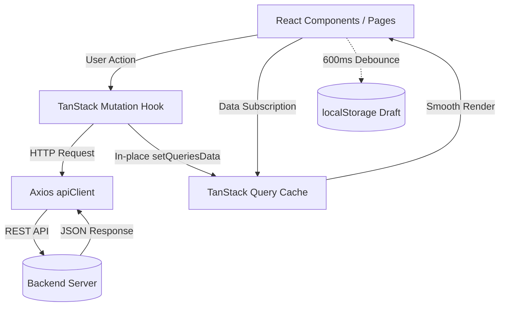

# 🏛️ AntiGravity Workflow System - Frontend Architecture

## 1. System Overview & Technology Stack

본 문서는 **AntiGravity Workflow Frontend (`workflow_react/`)**의 시스템 아키텍처 및 세부 설계 지침서입니다.

- **Core**: React 18 + TypeScript + Vite
- **Server State & Caching**: TanStack Query (React Query v5)
- **HTTP Client**: Axios (`apiClient`)
- **Styling**: CSS Variables + Dark Modern Tech (VS Code / Linear) Glassmorphism System
- **Realtime**: Socket.IO Client
- **Quality & Review**: `react-component-reviewer` 스킬을 통한 모듈화/안전성 자동 검증

```text
[AntiGravity Workflow Frontend Architecture]
 └── 🌐 Client Layer (workflow_react/):
      ├── 🚀 Entry & Routing: main.tsx, App.tsx, react-router-dom
      ├── 🛡️ Contexts: AuthContext (세션), WorkspaceContext (테넌트)
      ├── 📡 API & Query Hooks: TanStack Query v5 기반 도메인별 훅 계층
      ├── 🧩 Modular Sub-Components: 
      │    ├── common/ (Button, TagBadge, TagInput, ModalWrapper)
      │    ├── kanban/ (Board, Column, Card, FilterBar)
      │    ├── issueDetail/ (Drawer, EditForm, Comments, Worklogs)
      │    ├── settings/ (ProfileTab, OrgTab, SystemTab, WorkspaceTab)
      │    └── chat/ (Channels, Messages, Reactions)
      ├── 💾 Persistence: localStorage 기반 draftStorage (600ms 디바운스)
      └── 🎨 Design Tokens: CSS Variables 색상 시스템 & 다크 테마
```

---

## 2. Directory Structure & Layer Responsibilities

```text
workflow_react/src/
├── api/                    # TanStack Query 훅 및 REST API 통신 모듈
├── components/             # 프레젠테이션 & 컨테이너 UI 컴포넌트
│   ├── common/             # Button, Badge, TagBadge, TagInput, ModalWrapper 등
│   ├── kanban/             # KanbanBoard, KanbanColumn, KanbanCard, KanbanFilterBar
│   ├── issueDetail/        # IssueDetailDrawer, IssueDetailEditForm, IssueDetailView
│   ├── settings/           # SettingsProfileTab, SettingsOrgTab, SettingsSystemTab 등
│   ├── chat/               # ChatDrawer, ChannelList, MessageItem, EmojiPicker
│   ├── dashboard/          # 통계 위젯, 최근 이슈 요약, 진척률 차트
│   └── layout/             # Header, Sidebar, Navigation
├── context/                # 전역 React Context (AuthContext, WorkspaceContext)
├── hooks/                  # 공통 커스텀 훅 (useActionFeedback, useOverlayClickClose)
├── lib/                    # apiClient(Axios 인터셉터), queryClient(TanStack)
├── pages/                  # 순수 오케스트레이터 페이지 (DashboardPage, IssuesPage 등)
├── types/                  # 전역 TypeScript 모델 & DTO 인터페이스 정의
└── utils/                  # draftStorage(임시저장), 날짜 포맷, 태그 색상 헬퍼
```

---

## 3. Sub-Component Modular Architecture & Safety Standards

모든 대규모 프론트엔드 기능 개발 및 페이지 구현 시 반드시 다음 **4대 컴포넌트 모듈화 안전 표준**을 엄격히 준수합니다.

### 3.1 대규모 단일 파일 금지 & 전담 서브 컴포넌트 분할 (Max 400줄)
- 거대한 단일 컴포넌트(Monolithic Component) 작성을 금지하며, 컴포넌트 파일 크기는 최대 **400줄 이하**로 유지합니다.
- 복합 UI(예: 설정 탭, 이슈 상세, 칸반 보드)는 반드시 `src/components/{domain}/` 하위의 **도메인 전담 서브 컴포넌트(Sub-components)**로 역할을 쪼개어 구성하고 `index.ts`를 통해 re-export 합니다.
- `pages/*.tsx` 파일은 복잡한 UI 렌더링 로직을 직접 포함하지 않고, 상태 오케스트레이션 및 서브 컴포넌트 배치만 담당하는 **순수 오케스트레이터(Pure Orchestrator)** 역할을 수행합니다.

### 3.2 모달 / 오버레이 컴포넌트의 Colocation(근접 배치) 원칙
- 특정 탭이나 하위 기능에서만 전용으로 사용되는 모달/다이얼로그(`AvatarCropModal`, `SprintManageIssuesModal` 등)는 최상위 부모 페이지에 방치하지 않고 해당 서브 컴포넌트 내부에 Colocation(직접 마운트)하거나, 부모에 둘 경우 JSX 렌더링 트리(`showModal && <Modal />`) 연결을 필수 유지합니다.

### 3.3 Ghost State (언팩 린트 묵살) 절대 금지
- `const [, setShowModal] = useState(false)` 처럼 상태 변수명을 생략하는 패턴은 **"상태는 변경되나 화면에 렌더링되지 않는 결함"**의 원인이므로 엄격히 차단합니다. 상태를 선언했다면 반드시 JSX에서 참조되어야 합니다.

### 3.4 `react-component-reviewer` 스킬 기반 자가 품질 검증
- 모든 컴포넌트 작업 완료 후 반드시 아래 스킬 스크립트를 실행하여 0 errors를 확인합니다:
  ```bash
  python .agents/skills/react-component-reviewer/scripts/component_reviewer.py workflow_react/src
  ```

---

## 4. Data Flow & State Management Principles



### 4.1 Server State (TanStack Query v5)
1. **깜빡임 없는 부드러운 렌더링 (Smooth Transitions)**:
   - `placeholderData: (previousData) => previousData`를 적용하여 쿼리 키 변경 시에도 빈 화면/스피너 노출 없이 이전 데이터를 유지하며 자연스럽게 전환합니다.
2. **In-place 캐시 즉시 갱신 (Optimistic Updates)**:
   - 데이터 생성/수정/삭제 시 전체 목록을 재요청(Refetch)하기 전 `queryClient.setQueriesData`를 통해 캐시를 즉시 부분 갱신합니다.
3. **불필요한 전체 리마운트 지양**:
   - 컴포넌트에 강제 `key`를 부여하여 화면 전체를 깜빡이며 리마운트하는 패턴을 금지하고, React 내부 상태로 스무스하게 갱신합니다.

### 4.2 Draft Persistence (`draftStorage.ts`)
- 이슈/프로젝트 생성 모달 및 수정 드로어에서 사용자가 작성 중인 폼 데이터를 600ms 디바운스로 `localStorage`에 자동 백업합니다.
- 페이지 이탈 후 재진입 시 복원 배너를 노출하여 작업 손실을 방지합니다.

---

## 5. UI/UX Design System & Token Integration

- **Visual Theme**: VS Code / Linear 스타일의 딥 다크 모던 테마.
- **CSS Variables**: `--primary`, `--bg-main`, `--bg-card`, `--border-light`, `--text-bright` 등 표준 변수 사용.
- **Micro-Interactions**: 호버 글로우, 반투명 글래스모피즘, 부드러운 토글 애니메이션.

---

## 6. Development & Build Standards

- **TypeScript Strict Mode**: 컴포넌트 Props 및 DTO 인터페이스 타입 강제.
- **Build Verification**: 수정 후 반드시 `npm run build` (`tsc -b && vite build`) 검증 (`0 errors`).
- **File Encoding**: 모든 소스 코드 및 문서는 `UTF-8 with BOM` (`utf-8-sig`) 저장.
