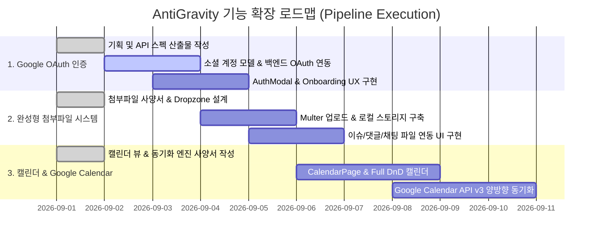

# 🗺️ AntiGravity Personal & Team Expansion Master Roadmap (프로젝트 확장 마스터 로드맵)

## 1. 프로젝트 비전 (Product Vision)
> **"개인의 완벽한 업무 처리 및 일정 관리부터, 소규모 팀의 유기적인 협업까지 아우르는 올인원 생산성 플랫폼"**

본 로드맵은 AntiGravity 시스템을 개인 전용 업무/일정 관리 도구이자 외부 동료들이 쉽게 참여할 수 있는 소규모 협업 플랫폼으로 발전시키기 위한 **3대 핵심 기능 확장 계획**을 정의합니다.

---

## 2. 3대 핵심 확장 기능 및 구현 단계

---

## 3. 단계별 개발 파이프라인 적용 가이드

### Phase 1: Google OAuth 간편 가입 & 온보딩
- **목표**: 외부 사용자가 이메일/비밀번호 없이 1초 만에 구글 계정으로 로그인하고 개인 워크스페이스를 자동 생성.
- **파이프라인 산출물**:
  1. `docs/features/01_GOOGLE_OAUTH_SPECIFICATION.md`
  2. `docs/api/auth/google-oauth.md`
  3. `src/modules/auth/services/googleOAuth.service.ts`
  4. `src/components/AuthModal.tsx` 개편
  5. `src/tests/auth.googleOAuth.test.ts` (100% Pass)

### Phase 2: 완전한 통합 파일 첨부 시스템 (Attachments)
- **목표**: 이슈, 댓글, 채팅에서 드래그 앤 드롭 및 클립보드 이미지 붙여넣기(Ctrl+V) 지원.
- **파이프라인 산출물**:
  1. `docs/features/02_ATTACHMENTS_SPECIFICATION.md`
  2. `docs/api/attachments/upload.md`
  3. `src/components/common/FileDropzone.tsx`, `AttachmentList.tsx`, `ImageLightboxModal.tsx`
  4. `src/modules/attachments/services/uploadAttachment.service.ts`
  5. `src/tests/attachments.upload.test.ts`

### Phase 3: 인터랙티브 캘린더 뷰 & Google Calendar 양방향 동기화
- **목표**: 월간/주간 캘린더 뷰에서 일정을 한눈에 조망하고 드래그로 일정을 변경하며, 구글 캘린더와 자동 동기화.
- **파이프라인 산출물**:
  1. `docs/features/03_GOOGLE_CALENDAR_SPECIFICATION.md`
  2. `docs/components/12_CALENDAR_COMPONENTS.md`
  3. `src/pages/CalendarPage.tsx`, `src/components/calendar/*`
  4. `src/modules/calendar/services/googleCalendarSync.service.ts`
  5. `src/tests/calendar.sync.test.ts`
