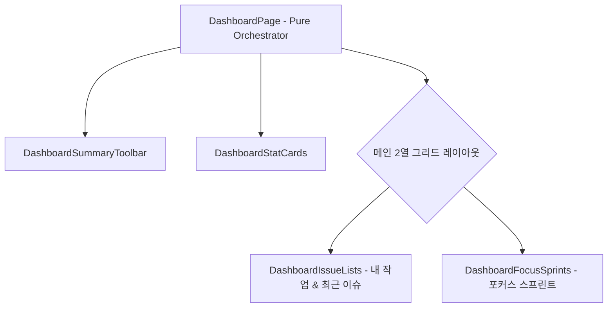

# 📊 AntiGravity Dashboard Components Specification (대시보드 설계 사양서)

본 문서는 대시보드 화면([`DashboardPage.tsx`](file:///C:/Users/admin/antigravity-workflow/workflow_react/src/pages/DashboardPage.tsx)) 및 [`workflow_react/src/components/dashboard/`](file:///C:/Users/admin/antigravity-workflow/workflow_react/src/components/dashboard) 하위 서브 컴포넌트들의 설계 사양을 정의합니다.

---

## 1. 컴포넌트 계층 및 아키텍처

---

## 2. 컴포넌트별 세부 사양

### 2.1 `DashboardPage` (오케스트레이터)
- **위치**: [`src/pages/DashboardPage.tsx`](file:///C:/Users/admin/antigravity-workflow/workflow_react/src/pages/DashboardPage.tsx)
- **책임**: 세션 사용자 정보와 프로젝트, 이슈, 스프린트 데이터를 TanStack Query로 조회하고, 4개 서브 컴포넌트에 데이터를 분배하는 순수 오케스트레이터.
- **연동 API & Query Hooks**:
  - `useIssues()`: 전체 이슈 목록 조회
  - `useProjects()`: 프로젝트 목록 및 메타데이터
  - `useSprints()`: 활성 스프린트 및 번다운 데이터
  - `useAuth()` / `useWorkspace()`: 현재 사용자 세션 및 선택된 워크스페이스

### 2.2 `DashboardSummaryToolbar`
- **위치**: [`src/components/dashboard/DashboardSummaryToolbar.tsx`](file:///C:/Users/admin/antigravity-workflow/workflow_react/src/components/dashboard/DashboardSummaryToolbar.tsx)
- **Props**:
  - `currentUser: User | null`: 현재 로그인한 사용자 정보
  - `workspaceName: string`: 워크스페이스 이름
  - `onQuickCreateIssue: () => void`: 빠른 일감 등록 모달 트리거
- **기능**: 환영 메시지, 오늘 날짜 표시, 새 일감 만들기 원클릭 액션 바.

### 2.3 `DashboardStatCards`
- **위치**: [`src/components/dashboard/DashboardStatCards.tsx`](file:///C:/Users/admin/antigravity-workflow/workflow_react/src/components/dashboard/DashboardStatCards.tsx)
- **Props**:
  - `totalIssuesCount: number`: 전체 이슈 수
  - `myIssuesCount: number`: 내게 할당된 일감 수
  - `inProgressCount: number`: 진행 중인 일감 수
  - `doneRatio: number`: 완료율 (%)
  - `activeSprintsCount: number`: 진행 중인 스프린트 수
- **기능**: 핵심 성과 지표(KPI) 통계 카드 4개 그리드 렌더링, 수치 증가 애니메이션 및 진척도 바 제공.

### 2.4 `DashboardIssueLists`
- **위치**: [`src/components/dashboard/DashboardIssueLists.tsx`](file:///C:/Users/admin/antigravity-workflow/workflow_react/src/components/dashboard/DashboardIssueLists.tsx)
- **Props**:
  - `myIssues: Issue[]`: 내 담당 일감 목록
  - `recentIssues: Issue[]`: 최근 생성/수정된 일감 목록
  - `onSelectIssue: (issueId: number) => void`: 일감 상세 드로어 오픈 콜백
- **기능**: 탭 전환('내 작업' / '최근 이슈'), 상태/우선순위 뱃지, D-Day 표시, 빈 데이터 처리.

### 2.5 `DashboardFocusSprints`
- **위치**: [`src/components/dashboard/DashboardFocusSprints.tsx`](file:///C:/Users/admin/antigravity-workflow/workflow_react/src/components/dashboard/DashboardFocusSprints.tsx)
- **Props**:
  - `activeSprints: Sprint[]`: 진행 중인 활성 스프린트 목록
  - `onSelectSprint: (sprintId: number) => void`: 스프린트 상세 이동 콜백
- **기능**: 스프린트 기간, 남은 일수(D-Day), 완료된 이슈 비율 바, 주요 목표(Goal) 요약 표시.
