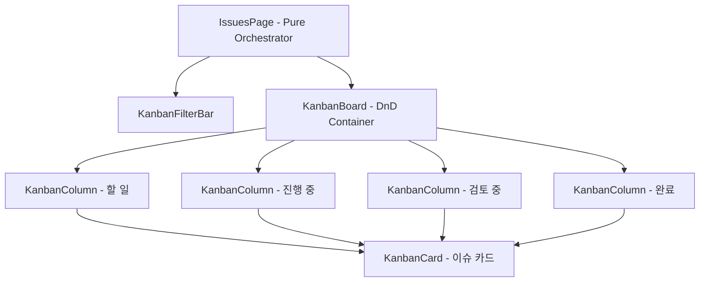

# 📋 AntiGravity Kanban & Issues Specification (칸반 및 이슈 관리 사양서)

본 문서는 칸반 보드 화면([`IssuesPage.tsx`](file:///C:/Users/admin/antigravity-workflow/workflow_react/src/pages/IssuesPage.tsx)) 및 [`workflow_react/src/components/kanban/`](file:///C:/Users/admin/antigravity-workflow/workflow_react/src/components/kanban) 하위 서브 컴포넌트들의 설계 사양을 정의합니다.

---

## 1. 컴포넌트 계층 및 아키텍처

---

## 2. 컴포넌트별 세부 사양

### 2.1 `IssuesPage` (오케스트레이터)
- **위치**: [`src/pages/IssuesPage.tsx`](file:///C:/Users/admin/antigravity-workflow/workflow_react/src/pages/IssuesPage.tsx)
- **상태 관리**:
  - `filterProjectId`: 선택된 프로젝트 필터 (전체/개별)
  - `filterAssigneeId`: 담당자 필터 (`ALL`, `MY`, 개별 userId)
  - `filterTag`: 해시태그 필터
  - `searchTerm`: 검색어 (제목, 설명, `#태그`)
  - `selectedIssueId`: 상세 드로어(`IssueDetailDrawer`)에 표시할 이슈 ID
  - `showCreateModal`: 신규 이슈 생성 모달 오픈 여부
- **연동 API**:
  - `useIssues()`, `useUpdateIssue()`, `useDeleteIssue()`, `useToggleLikeIssue()`

### 2.2 `KanbanFilterBar`
- **위치**: [`src/components/kanban/KanbanFilterBar.tsx`](file:///C:/Users/admin/antigravity-workflow/workflow_react/src/components/kanban/KanbanFilterBar.tsx)
- **Props**:
  - `projects: Project[]`, `users: User[]`, `tags: Tag[]`
  - `selectedProjectId: number | 'ALL'`, `onSelectProject: (id: any) => void`
  - `selectedAssigneeId: string`, `onSelectAssignee: (id: string) => void`
  - `selectedTag: string`, `onSelectTag: (tag: string) => void`
  - `searchTerm: string`, `onSearchChange: (term: string) => void`
  - `onOpenCreateModal: () => void`
- **기능**: 다중 조건 필터링, 실시간 검색 인풋, 새 이슈 등록 버튼, 필터 초기화 버튼.

### 2.3 `KanbanBoard` & `KanbanColumn`
- **`KanbanBoard`**:
  - **위치**: [`src/components/kanban/KanbanBoard.tsx`](file:///C:/Users/admin/antigravity-workflow/workflow_react/src/components/kanban/KanbanBoard.tsx)
  - 4개 표준 카테고리(TODO, IN_PROGRESS, IN_REVIEW, DONE) 컬럼을 가로 스크롤 레이아웃으로 렌더링.
  - HTML5 Drag and Drop 이벤트 (`onDragOver`, `onDrop`)를 처리하여 컬럼 간 이동 시 상태(`statusId`) 즉시 갱신.
- **`KanbanColumn`**:
  - **위치**: [`src/components/kanban/KanbanColumn.tsx`](file:///C:/Users/admin/antigravity-workflow/workflow_react/src/components/kanban/KanbanColumn.tsx)
  - **Props**: `category: string`, `title: string`, `issues: Issue[]`, `onDropIssue: (issueId: number, targetStatus: string) => void`
  - 컬럼 상단 이슈 카운트 뱃지, 인라인 빠른 카드 추가 버튼 제공.

### 2.4 `KanbanCard`
- **위치**: [`src/components/kanban/KanbanCard.tsx`](file:///C:/Users/admin/antigravity-workflow/workflow_react/src/components/kanban/KanbanCard.tsx)
- **Props**:
  - `issue: Issue`: 렌더링할 이슈 데이터
  - `onClick: (issue: Issue) => void`: 카드 클릭 시 상세 드로어 열기
  - `onToggleLike: (issueId: number) => void`: 좋아요 토글
  - `onToggleFavorite: (issueId: number) => void`: 즐겨찾기 토글
  - `onTagClick: (tagName: string) => void`: 태그 클릭 시 태그 필터 즉시 적용
- **카드 구성 요소**:
  - 이슈 식별 키 (예: `AGY-102`), 우선순위 화살표 뱃지, 제목, 진척도 프로그레스 바, 기한(Due date) D-Day, 담당자 아바타, 해시태그 목록, 좋아요/댓글 수.
