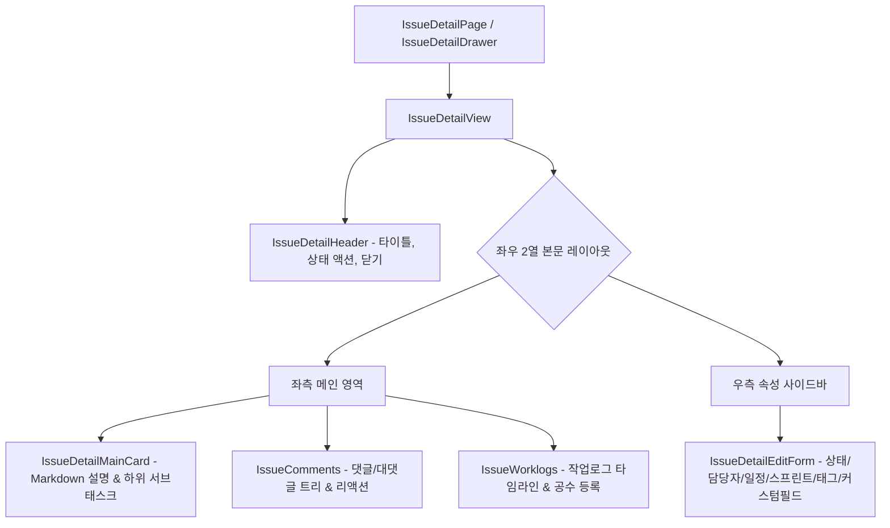

# 🔍 AntiGravity Issue Detail Components Specification (이슈 상세 설계 사양서)

본 문서는 이슈 상세 화면([`IssueDetailPage.tsx`](file:///C:/Users/admin/antigravity-workflow/workflow_react/src/pages/IssueDetailPage.tsx)), 우측 슬라이딩 드로어([`IssueDetailDrawer.tsx`](file:///C:/Users/admin/antigravity-workflow/workflow_react/src/components/issueDetail/IssueDetailDrawer.tsx)) 및 [`workflow_react/src/components/issueDetail/`](file:///C:/Users/admin/antigravity-workflow/workflow_react/src/components/issueDetail) 하위 서브 컴포넌트들의 설계 사양을 정의합니다.

---

## 1. 컴포넌트 계층 및 아키텍처

---

## 2. 컴포넌트별 세부 사양

### 2.1 `IssueDetailDrawer` & `IssueDetailPage`
- **`IssueDetailDrawer`**: 우측에서 부드럽게 슬라이드되는 오버레이 드로어. 바깥 영역 클릭 또는 ESC 키로 닫힘.
- **`IssueDetailPage`**: 전체 화면 페이지 라우트 (`/issues/:id`).
- **임시 저장(Draft Persistence)**: 폼 수정 중 600ms 디바운스로 `localStorage`에 자동 백업(`draftStorage.ts`), 재진입 시 복원 배너 노출.

### 2.2 `IssueDetailHeader`
- **위치**: [`src/components/issueDetail/IssueDetailHeader.tsx`](file:///C:/Users/admin/antigravity-workflow/workflow_react/src/components/issueDetail/IssueDetailHeader.tsx)
- **Props**:
  - `issue: Issue`: 현재 이슈 정보
  - `onTitleChange: (newTitle: string) => void`: 제목 인라인 편집
  - `onDelete: () => void`: 삭제 확인 모달 호출
  - `onClose?: () => void`: 드로어 닫기 콜백
- **기능**: 이슈 번호 및 복사 기능, 제목 인라인 인풋, 즐겨찾기/좋아요 버튼, 삭제 및 닫기 액션.

### 2.3 `IssueDetailMainCard`
- **위치**: [`src/components/issueDetail/IssueDetailMainCard.tsx`](file:///C:/Users/admin/antigravity-workflow/workflow_react/src/components/issueDetail/IssueDetailMainCard.tsx)
- **Props**:
  - `description: string`, `onDescriptionChange: (desc: string) => void`
  - `childrenIssues?: Issue[]`: 하위 이슈 목록
  - `onAddSubtask?: () => void`: 하위 이슈 추가 핸들러
- **기능**: Markdown 에디터/뷰어 실시간 토글, 첨부파일 목록, 하위 서브태스크 진행률 바 및 체크리스트.

### 2.4 `IssueDetailEditForm`
- **위치**: [`src/components/issueDetail/IssueDetailEditForm.tsx`](file:///C:/Users/admin/antigravity-workflow/workflow_react/src/components/issueDetail/IssueDetailEditForm.tsx)
- **Props**:
  - `issue: Issue`, `projects: Project[]`, `users: User[]`, `sprints: Sprint[]`, `tags: Tag[]`
  - `customFields: CustomFieldDefinition[]`
  - `onFieldChange: (field: string, value: any) => void`
- **속성 제어 항목**:
  - 프로젝트, 스프린트, 이슈 유형(Type), 상태(Status), 우선순위(Priority), 담당자(Assignee), 시작일/마감일, 스토리포인트, 진척도(%), 해시태그(`TagInput`), 동적 커스텀 필드.

### 2.5 `IssueComments`
- **위치**: [`src/components/issueDetail/IssueComments.tsx`](file:///C:/Users/admin/antigravity-workflow/workflow_react/src/components/issueDetail/IssueComments.tsx)
- **API 연동**: `useComments(issueId)`, `useCreateComment()`, `useDeleteComment()`, `useAddCommentReaction()`
- **기능**:
  - 무제한 계층 대댓글 트리 렌더링 (`commentTree.ts`)
  - 마크다운 지원 댓글 입력창
  - 이모지 리액션(좋아요, 하트, 따봉 등) 토글
  - 작성자 본인 확인 후 삭제 기능.

### 2.6 `IssueWorklogs`
- **위치**: [`src/components/issueDetail/IssueWorklogs.tsx`](file:///C:/Users/admin/antigravity-workflow/workflow_react/src/components/issueDetail/IssueWorklogs.tsx)
- **API 연동**: `getWorklogs()`, `createWorklog()`
- **기능**:
  - 등록된 공수(소요시간) 타임라인 목록 및 누적 작업 시간(총 시간/분) 배너 표시
  - 신규 공수 등록 인라인 폼 (시간/분 입력, 작업 내용 설명, 작업 일자 선택).
