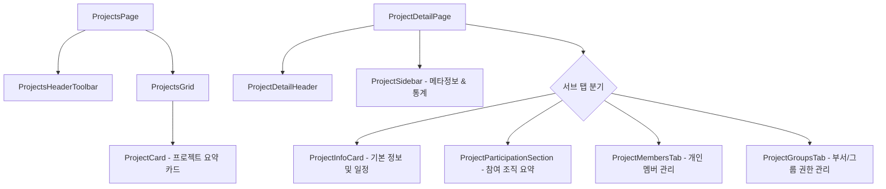

# 📁 AntiGravity Projects Components Specification (프로젝트 관리 설계 사양서)

본 문서는 프로젝트 목록([`ProjectsPage.tsx`](file:///C:/Users/admin/antigravity-workflow/workflow_react/src/pages/ProjectsPage.tsx)), 프로젝트 상세([`ProjectDetailPage.tsx`](file:///C:/Users/admin/antigravity-workflow/workflow_react/src/pages/ProjectDetailPage.tsx)) 및 관련 서브 컴포넌트들의 설계 사양을 정의합니다.

---

## 1. 컴포넌트 계층 및 아키텍처

---

## 2. 컴포넌트별 세부 사양

### 2.1 `ProjectsPage` & `ProjectsGrid` & `ProjectCard`
- **`ProjectsHeaderToolbar`**: 프로젝트 검색, 상태 필터, 새 프로젝트 등록 모달 오픈 버튼.
- **`ProjectsGrid`**: 3열 카드 그리드 레이아웃.
- **`ProjectCard`**:
  - 프로젝트 Key(예: `AGY`), 프로젝트명, 설명, 상태/우선순위 뱃지
  - 소속 멤버수, 연결된 이슈 수, 전체 진척률 프로그레스 바
  - 즐겨찾기 별 버튼, 카드 클릭 시 상세 페이지(`/projects/:id`) 이동.

### 2.2 `ProjectDetailPage` (오케스트레이터)
- **위치**: [`src/pages/ProjectDetailPage.tsx`](file:///C:/Users/admin/antigravity-workflow/workflow_react/src/pages/ProjectDetailPage.tsx)
- **상태 관리**:
  - `activeTab`: 'overview' | 'members' | 'groups' | 'settings'
  - `editName`, `editKey`, `editDescription`, `editPlannedStartDate`, `editDueDate` 등
  - `showAddMemberModal`, `showAddGroupModal`, `showDeleteConfirm`
- **연동 API**: `useProject(id)`, `useUpdateProject()`, `useDeleteProject()`, `addProjectMember()`, `addProjectGroup()`

### 2.3 `ProjectMembersTab`
- **위치**: [`src/components/projectDetail/ProjectMembersTab.tsx`](file:///C:/Users/admin/antigravity-workflow/workflow_react/src/components/projectDetail/ProjectMembersTab.tsx)
- **Props**:
  - `project: Project`, `allUsers: User[]`, `isPM: boolean`
  - `handleUpdateMemberRole: (userId: number, role: string) => Promise<void>`
  - `handleRemoveMember: (userId: number) => Promise<void>`
  - `showAddMemberModal: boolean`, `setShowAddMemberModal: (show: boolean) => void`
  - `handleAddMember: (e: React.FormEvent) => Promise<void>`
- **기능**: 프로젝트 멤버 목록 렌더링, 역할(ADMIN, MEMBER, VIEWER) 인라인 셀렉트 변경, 멤버 제외, 신규 멤버 추가 모달 렌더링(Colocation).

### 2.4 `ProjectGroupsTab`
- **위치**: [`src/components/projectDetail/ProjectGroupsTab.tsx`](file:///C:/Users/admin/antigravity-workflow/workflow_react/src/components/projectDetail/ProjectGroupsTab.tsx)
- **Props**:
  - `project: Project`, `allGroups: Group[]`, `isPM: boolean`
  - `handleUpdateGroupRole: (groupId: number, role: string) => Promise<void>`
  - `handleRemoveGroup: (groupId: number) => Promise<void>`
  - `showAddGroupModal: boolean`, `setShowAddGroupModal: (show: boolean) => void`
  - `handleAddGroup: (e: React.FormEvent) => Promise<void>`
- **기능**: 프로젝트에 매핑된 부서(그룹) 목록, 그룹 권한 변경, 그룹 연결 해제, 부서 추가 모달 렌더링(Colocation).
