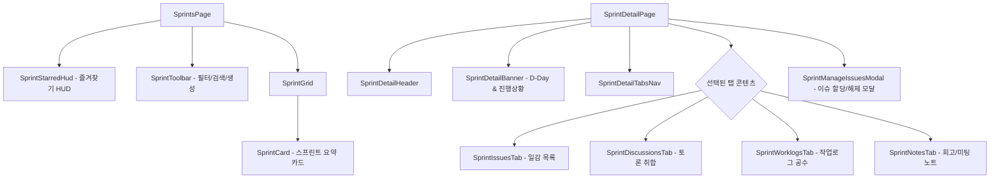

# 🏃 AntiGravity Sprints Components Specification (스프린트 관리 설계 사양서)

본 문서는 스프린트 목록([`SprintsPage.tsx`](file:///C:/Users/admin/antigravity-workflow/workflow_react/src/pages/SprintsPage.tsx)), 스프린트 상세([`SprintDetailPage.tsx`](file:///C:/Users/admin/antigravity-workflow/workflow_react/src/pages/SprintDetailPage.tsx)) 및 [`workflow_react/src/components/sprints/`](file:///C:/Users/admin/antigravity-workflow/workflow_react/src/components/sprints), [`sprintDetail/`](file:///C:/Users/admin/antigravity-workflow/workflow_react/src/components/sprintDetail) 하위 서브 컴포넌트들의 설계 사양을 정의합니다.

---

## 1. 컴포넌트 계층 및 아키텍처

---

## 2. 컴포넌트별 세부 사양

### 2.1 `SprintsPage` & `SprintGrid` & `SprintCard`
- **`SprintToolbar`**: 스프린트 상태 필터 (전체/진행중/예정/완료), 검색 인풋, 새 스프린트 생성 버튼.
- **`SprintStarredHud`**: 즐겨찾기로 등록된 스프린트들을 상단에 고정 카드로 노출하여 빠른 접근 지원.
- **`SprintCard`**:
  - 스프린트 이름, 목표(Goal), 시작일/종료일, D-Day 뱃지, 진척률(완료 이슈 수 / 전체 이슈 수).
  - 카드 클릭 시 상세 페이지 또는 상세 모달(`SprintDetailModal`) 오픈.

### 2.2 `SprintDetailPage` (오케스트레이터)
- **위치**: [`src/pages/SprintDetailPage.tsx`](file:///C:/Users/admin/antigravity-workflow/workflow_react/src/pages/SprintDetailPage.tsx)
- **상태 관리**:
  - `activeTab`: 'issues' | 'discussions' | 'worklogs' | 'notes'
  - `showManageModal`: 스프린트 일감 관리(추가/제외) 모달 상태
  - `showEditModal`: 스프린트 정보 수정 모달 상태
- **연동 API**: `getSprint(id)`, `updateSprint()`, `assignIssuesToSprint()`, `getSprintDiscussions()`, `getSprintWorklogs()`

### 2.3 서브 탭 컴포넌트 군
- **`SprintIssuesTab`**: 스프린트에 할당된 이슈 목록을 상태별로 확인하고, 완료 체크 및 인라인 상태 변경.
- **`SprintDiscussionsTab`**: 해당 스프린트 소속 이슈들에 작성된 모든 댓글/토론을 타임라인으로 한눈에 파악.
- **`SprintWorklogsTab`**: 스프린트 기간 동안 소속 이슈들에 투입된 총 공수(소요시간)를 작업자별/일자별로 취합 통계 제공.
- **`SprintNotesTab`**: 스프린트 킥오프 미팅, 데일리 스크럼, 스프린트 회고(Retrospective) Markdown 노트 작성 및 실시간 저장.

### 2.4 `SprintManageIssuesModal`
- **위치**: [`src/components/sprints/SprintManageIssuesModal.tsx`](file:///C:/Users/admin/antigravity-workflow/workflow_react/src/components/sprints/SprintManageIssuesModal.tsx)
- **Props**: `isOpen: boolean`, `onClose: () => void`, `sprint: Sprint`, `availableIssues: Issue[]`, `onSave: (selectedIssueIds: number[]) => Promise<void>`
- **기능**: 현재 프로젝트의 백로그 이슈 목록을 체크박스로 다중 선택하여 스프린트에 일괄 할당/해제.
