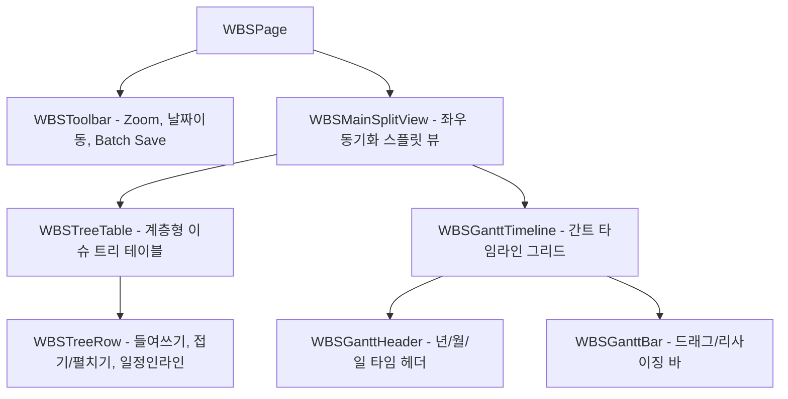

# 📊 AntiGravity WBS & Gantt Chart Specification (WBS 및 간트 차트 사양서)

본 문서는 WBS 화면([`WBSPage.tsx`](file:///C:/Users/admin/antigravity-workflow/workflow_react/src/pages/WBSPage.tsx)) 및 [`workflow_react/src/components/wbs/`](file:///C:/Users/admin/antigravity-workflow/workflow_react/src/components/wbs) 하위 서브 컴포넌트들의 설계 사양을 정의합니다.

---

## 1. 컴포넌트 계층 및 아키텍처

---

## 2. 컴포넌트별 세부 사양

### 2.1 `WBSPage` (오케스트레이터)
- **위치**: [`src/pages/WBSPage.tsx`](file:///C:/Users/admin/antigravity-workflow/workflow_react/src/pages/WBSPage.tsx)
- **커스텀 훅 의존성**:
  - [`useWBSProjectData`](file:///C:/Users/admin/antigravity-workflow/workflow_react/src/hooks/useWBSProjectData.ts): 프로젝트별 이슈 계층 트리(`wbsUtils.ts`) 빌드 및 일정 변경 임시 상태(Dirty state) 버퍼 관리.
  - [`useWBSGanttDrag`](file:///C:/Users/admin/antigravity-workflow/workflow_react/src/hooks/useWBSGanttDrag.ts): 간트 바 마우스 드래그 이동 및 양 끝 리사이징(Start/End date 변경) 픽셀 계산.
- **API 연동**: `batchUpdateIssueSchedules()` (일괄 스케줄 저장)

### 2.2 `WBSToolbar`
- **위치**: [`src/components/wbs/WBSToolbar.tsx`](file:///C:/Users/admin/antigravity-workflow/workflow_react/src/components/wbs/WBSToolbar.tsx)
- **Props**:
  - `zoomLevel: 'day' | 'week' | 'month'`, `onZoomChange: (z: any) => void`
  - `onTodayClick: () => void`: 오늘 날짜로 타임라인 스크롤
  - `onExpandAll: () => void`, `onCollapseAll: () => void`: 전체 접기/펼치기
  - `hasDirtyChanges: boolean`, `onSaveBatch: () => Promise<void>`: 일괄 저장
  - `filterProjectId: number | 'ALL'`, `onProjectChange: (id: any) => void`

### 2.3 `WBSTreeTable` & `WBSTreeRow`
- **`WBSTreeTable`**: 계층 번호(WBS Code 예: 1.1, 1.1.2), 제목, 담당자, 시작일, 기한, 진행률, 액션 컬럼 렌더링.
- **`WBSTreeRow`**:
  - 부모 노드의 경우 접기/펼치기 토글 화살표(`ChevronRight` / `ChevronDown`)
  - 깊이(depth)에 따른 인덴트 패딩
  - 시작일/종료일 인라인 날짜 피커 변경 시 Dirty 버퍼에 반영.

### 2.4 `WBSGanttTimeline` & `WBSGanttBar`
- **`WBSGanttTimeline`**:
  - 좌측 트리 테이블과 1:1 수직 스크롤 동기화.
  - 주말(토/일) 배경 음영 처리 및 오늘(Today) 수직 빨간색 인디케이터 라인 표시.
- **`WBSGanttBar`**:
  - 시작일~기한에 해당하는 기간을 바(Bar) 형태로 렌더링.
  - 바 내부 진척도(%) 컬러 채우기.
  - 좌우 핸들 드래그를 통한 일정 기간 연장/축소, 바 몸체 드래그를 통한 일정 전체 이동.
