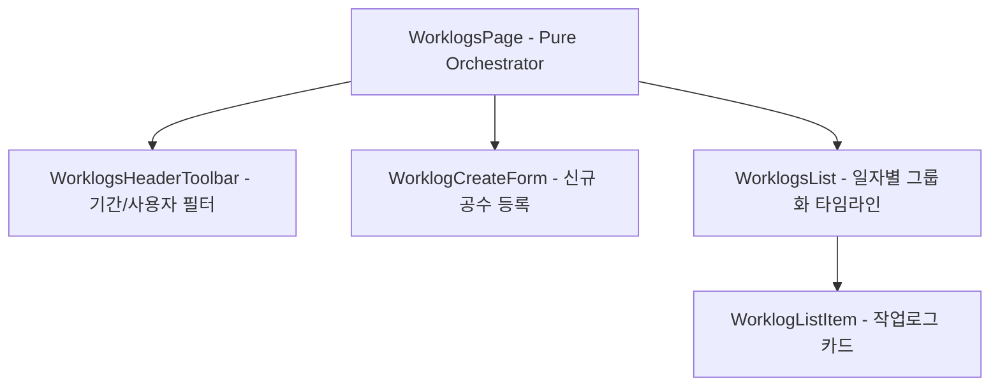

# ⏱️ AntiGravity Worklogs Components Specification (작업로그 설계 사양서)

본 문서는 작업로그 화면([`WorklogsPage.tsx`](file:///C:/Users/admin/antigravity-workflow/workflow_react/src/pages/WorklogsPage.tsx)) 및 [`workflow_react/src/components/worklogs/`](file:///C:/Users/admin/antigravity-workflow/workflow_react/src/components/worklogs) 하위 서브 컴포넌트들의 설계 사양을 정의합니다.

---

## 1. 컴포넌트 계층 및 아키텍처

---

## 2. 컴포넌트별 세부 사양

### 2.1 `WorklogsPage` (오케스트레이터)
- **위치**: [`src/pages/WorklogsPage.tsx`](file:///C:/Users/admin/antigravity-workflow/workflow_react/src/pages/WorklogsPage.tsx)
- **상태 관리**:
  - `periodFilter`: 'today' | 'this_week' | 'this_month' | 'all'
  - `selectedUserId`: 특정 사용자 공수 필터
  - `showCreateForm`: 신규 공수 등록 폼 펼침 여부
- **연동 API**: `useWorklogs()`, `useCreateWorklog()`

### 2.2 `WorklogsHeaderToolbar`
- **위치**: [`src/components/worklogs/WorklogsHeaderToolbar.tsx`](file:///C:/Users/admin/antigravity-workflow/workflow_react/src/components/worklogs/WorklogsHeaderToolbar.tsx)
- **기능**: 기간 선택 버튼 그룹, 작업자 선택 드롭다운, 기간 내 총 누적 공수(시간/분) 요약 배너, '새 작업로그' 버튼.

### 2.3 `WorklogCreateForm`
- **위치**: [`src/components/worklogs/WorklogCreateForm.tsx`](file:///C:/Users/admin/antigravity-workflow/workflow_react/src/components/worklogs/WorklogCreateForm.tsx)
- **Props**: `issues: Issue[]`, `onSubmit: (data: any) => Promise<void>`, `onCancel: () => void`
- **입력 필드**: 대상 이슈 선택 드롭다운, 소요 시간(분 단위 또는 '2h 30m' 포맷 파싱), 시작 일시, 작업 내용 설명.

### 2.4 `WorklogsList` & `WorklogListItem`
- **`WorklogsList`**: 등록된 작업로그들을 작업 일자(날짜)별로 그룹화하여 타임라인 형태로 렌더링.
- **`WorklogListItem`**:
  - 작업자 아바타 및 이름, 소속 이슈 키 및 제목 링크, 소요 시간 뱃지(예: `2h 30m`), 작업 설명 텍스트.
