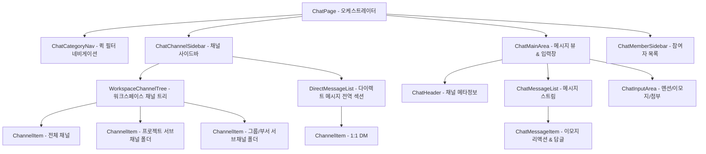

# 💬 AntiGravity Chat Components Specification (채팅 컴포넌트 사양서)

본 문서는 [`workflow_react/src/components/chat/`](file:///C:/Users/admin/antigravity-workflow/workflow_react/src/components/chat) 하위의 실시간 채팅 시스템 및 **워크스페이스 & 서브채널 트리 계층 UI** 설계 사양을 정의합니다.

---

## 1. 컴포넌트 계층 및 아키텍처

---

## 2. 서브 컴포넌트별 세부 사양

### 2.1 `WorkspaceChannelTree`
- **위치**: [`src/components/chat/sidebar/WorkspaceChannelTree.tsx`](file:///C:/Users/admin/antigravity-workflow/workflow_react/src/components/chat/sidebar/WorkspaceChannelTree.tsx)
- **Props**:
  - `workspaceName: string` (예: `박주영's Workspace`)
  - `channels: ChatChannel[]`
  - `selectedChannelId: number | null`
  - `onSelectChannel: (channelId: number) => void`
  - `collapsedCategories: Record<string, boolean>`
  - `toggleCategoryCollapse: (cat: ChannelType) => void`
  - `handleOpenCreateForCategory: (cat: ChannelType, e: React.MouseEvent) => void`
- **트리 계층 구조**:
  - 🏢 **`[워크스페이스명]'s Workspace`** (헤더)
    - 📢 **전체 채널** (`GLOBAL`: `전체-공지사항`, `자유-수다방`)
    - 📁 **프로젝트 채널** (서브 카테고리 폴더, 접기/펼치기, 하위 인덴트)
      - 📁 A 프로젝트
      - 📁 B 프로젝트
    - 👥 **그룹 채널** (서브 카테고리 폴더, 접기/펼치기, 하위 인덴트)
      - 👥 SW 개발팀
      - 👥 QA 테스터팀

### 2.2 `DirectMessageList`
- **위치**: [`src/components/chat/sidebar/DirectMessageList.tsx`](file:///C:/Users/admin/antigravity-workflow/workflow_react/src/components/chat/sidebar/DirectMessageList.tsx)
- **Props**: `channels: ChatChannel[]`, `selectedChannelId: number | null`, `onSelectChannel: (id: number) => void`, `onOpenCreateDm: (e: React.MouseEvent) => void`
- **기능**: 워크스페이스와 독립된 1:1 다이렉트 메시지 리스트 제공 및 실시간 안 읽은 메시지 배지 표시.

### 2.3 `ChannelItem`
- **위치**: [`src/components/chat/sidebar/ChannelItem.tsx`](file:///C:/Users/admin/antigravity-workflow/workflow_react/src/components/chat/sidebar/ChannelItem.tsx)
- **Props**: `channel: ChatChannel`, `isSelected: boolean`, `onSelectChannel: (id: number) => void`, `indentLevel?: number`
- **기능**: 트리 계층에 맞춘 `indentLevel` 기반 인덴트 패딩, 채널 아이콘, 마지막 메시지 프리뷰, 음소거/멘션 전용 뱃지 렌더링.
