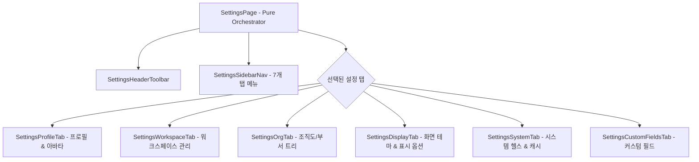

# ⚙️ AntiGravity Settings Components Specification (설정 관리 설계 사양서)

본 문서는 환경설정 화면([`SettingsPage.tsx`](file:///C:/Users/admin/antigravity-workflow/workflow_react/src/pages/SettingsPage.tsx)) 및 [`workflow_react/src/components/settings/`](file:///C:/Users/admin/antigravity-workflow/workflow_react/src/components/settings) 하위 서브 탭 컴포넌트들의 설계 사양을 정의합니다.

---

## 1. 컴포넌트 계층 및 아키텍처

---

## 2. 컴포넌트별 세부 사양

### 2.1 `SettingsPage` (오케스트레이터)
- **위치**: [`src/pages/SettingsPage.tsx`](file:///C:/Users/admin/antigravity-workflow/workflow_react/src/pages/SettingsPage.tsx)
- **상태 관리**: `activeTab`: 'profile' | 'workspace' | 'org' | 'display' | 'system' | 'customFields'
- **책임**: 사이드바 메뉴 탭 전환 및 각 전담 서브 컴포넌트 렌더링.

### 2.2 `SettingsProfileTab`
- **위치**: [`src/components/settings/SettingsProfileTab.tsx`](file:///C:/Users/admin/antigravity-workflow/workflow_react/src/components/settings/SettingsProfileTab.tsx)
- **기능**:
  - 이름, 이메일, 아바타 배경색 수정.
  - 아바타 이미지 업로드 및 [`AvatarCropModal`](file:///C:/Users/admin/antigravity-workflow/workflow_react/src/components/AvatarCropModal.tsx) 연동.
  - 비밀번호 변경 폼.

### 2.3 `SettingsWorkspaceTab`
- **위치**: [`src/components/settings/SettingsWorkspaceTab.tsx`](file:///C:/Users/admin/antigravity-workflow/workflow_react/src/components/settings/SettingsWorkspaceTab.tsx)
- **기능**: 워크스페이스 명칭/설명 변경, 멤버 목록 및 권한(Owner/Admin/Member) 관리, 멤버 초대 모달([`WorkspaceInviteModal`](file:///C:/Users/admin/antigravity-workflow/workflow_react/src/components/workspace/WorkspaceInviteModal.tsx)) 트리거, 워크스페이스 탈퇴 및 삭제.

### 2.4 `SettingsOrgTab`
- **위치**: [`src/components/settings/SettingsOrgTab.tsx`](file:///C:/Users/admin/antigravity-workflow/workflow_react/src/components/settings/SettingsOrgTab.tsx)
- **기능**:
  - 계층형 조직도(부서/팀) 트리 렌더링.
  - 신규 부서 생성/수정 모달([`GroupModal`](file:///C:/Users/admin/antigravity-workflow/workflow_react/src/components/GroupModal.tsx)) Colocation 연동.
  - 부서원 배정 및 직책(리더/팀원) 관리.

### 2.5 `SettingsDisplayTab`
- **위치**: [`src/components/settings/SettingsDisplayTab.tsx`](file:///C:/Users/admin/antigravity-workflow/workflow_react/src/components/settings/SettingsDisplayTab.tsx)
- **기능**: 다크/라이트 테마 선택, 카드 밀도(Compact / Normal), 달력 시작 요일(일요일 / 월요일 시작), 데스크톱 알림 활성화 설정 (`prefRepository.ts` 영속화).

### 2.6 `SettingsSystemTab`
- **위치**: [`src/components/settings/SettingsSystemTab.tsx`](file:///C:/Users/admin/antigravity-workflow/workflow_react/src/components/settings/SettingsSystemTab.tsx)
- **기능**: 백엔드 REST API 서버 상태(Health Check), 데이터베이스 연결 상태, 클라이언트 버전 확인 및 로컬 임시 캐시 일괄 삭제.

### 2.7 `SettingsCustomFieldsTab`
- **위치**: [`src/components/settings/SettingsCustomFieldsTab.tsx`](file:///C:/Users/admin/antigravity-workflow/workflow_react/src/components/settings/SettingsCustomFieldsTab.tsx)
- **기능**: 이슈 전용 동적 사용자 정의 필드(String, Number, Date, Select 등) 목록 조회, 신규 필드 정의 모달([`CustomFieldsModal`](file:///C:/Users/admin/antigravity-workflow/workflow_react/src/components/CustomFieldsModal.tsx)) 및 삭제 관리.
