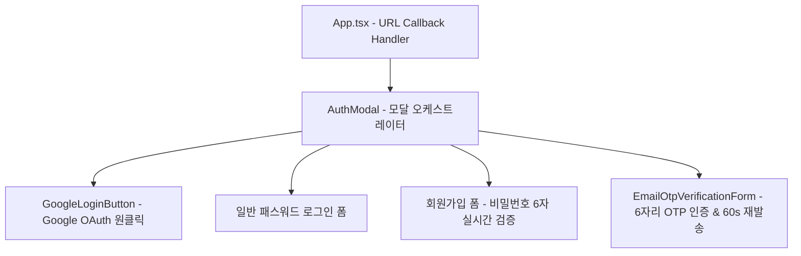

# 🔐 AntiGravity Auth & OAuth Components Specification (인증 및 소셜 로그인 컴포넌트 사양서)

본 문서는 [`workflow_react/src/components/AuthModal.tsx`](file:///C:/Users/admin/antigravity-workflow/workflow_react/src/components/AuthModal.tsx) 및 [`workflow_react/src/components/auth/`](file:///C:/Users/admin/antigravity-workflow/workflow_react/src/components/auth) 하위 서브 컴포넌트들의 설계 사양을 정의합니다.

---

## 1. 컴포넌트 계층 및 아키텍처

---

## 2. 컴포넌트별 세부 사양

### 2.1 `AuthModal` (모달 오케스트레이터)
- **위치**: [`src/components/AuthModal.tsx`](file:///C:/Users/admin/antigravity-workflow/workflow_react/src/components/AuthModal.tsx)
- **Props**: `isOpen: boolean`, `onClose: () => void`
- **상태 관리**:
  - `mode`: `'LOGIN'` | `'SIGNUP'` | `'VERIFY_OTP'`
  - `email`, `password`, `name`, `otpCode`
  - `errorMsg`, `successMsg`, `submitting`, `googleLoading`
  - `cooldown`: 60초 재발송 타이머

### 2.2 `GoogleLoginButton`
- **위치**: [`src/components/auth/GoogleLoginButton.tsx`](file:///C:/Users/admin/antigravity-workflow/workflow_react/src/components/auth/GoogleLoginButton.tsx)
- **Props**:
  - `onSuccess: (accessToken: string) => Promise<void>`
  - `onError: (errMsg: string) => void`
  - `isLoading: boolean`, `setIsLoading: (loading: boolean) => void`
- **기능**: Google 공식 브랜드 가이드라인 준수 버튼 UI 및 `@react-oauth/google` `useGoogleLogin` 팝업 연동.

### 2.3 `EmailOtpVerificationForm`
- **위치**: [`src/components/auth/EmailOtpVerificationForm.tsx`](file:///C:/Users/admin/antigravity-workflow/workflow_react/src/components/auth/EmailOtpVerificationForm.tsx)
- **Props**:
  - `email: string`, `otpCode: string`, `setOtpCode: (code: string) => void`
  - `submitting: boolean`, `cooldown: number`
  - `onVerify: (e: React.FormEvent) => void`, `onResend: () => void`, `onBackToLogin: () => void`
- **기능**: 대형 6자리 숫자 입력창(글자 간격 6px), 재발송 쿨다운 타이머(60s), 인증 완료 버튼.
