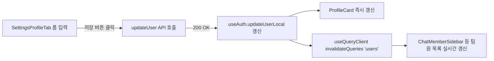

# 👥 Users & Profile 컴포넌트 사양서 (`docs/components/users_COMPONENTS.md`)

사용자 프로필 관리, 자기소개(`bio`), 소속 부서(`department`), 직책(`jobTitle`)의 입력 및 주요 화면 노출 컴포넌트 명세입니다.

---

## 1. 컴포넌트 구조 및 역할

```text
src/
├── components/
│   ├── settings/
│   │   └── SettingsProfileTab.tsx   # 프로필 설정 폼 (이름, bio, department, jobTitle 입력)
│   ├── ProfileCard.tsx              # 좌측 하단 프로필 카드 (이름, 부서/직책 배지, bio 툴팁)
│   └── chat/
│       └── ChatMemberSidebar.tsx    # 채팅방 멤버 사이드바 (이름, 부서/직책 서브텍스트)
└── pages/
    └── SettingsPage.tsx             # 환경설정 오케스트레이터 페이지
```

---

## 2. 서브 컴포넌트 상세 명세

### 2.1 `SettingsProfileTab.tsx`
- **역할**: 사용자 기본 프로필 정보 및 확장 프로필(자기 설명, 소속 부서, 직책)을 수정하는 탭 뷰.
- **입력 필드**:
  1. `이름 (Display Name)`: 텍스트 입력 (필수)
  2. `소속 부서 (Department)`: 텍스트 입력 (선택, 최대 100자, 예: '플랫폼개발팀')
  3. `직책 / 역할 (Job Title / Position)`: 텍스트 입력 (선택, 최대 100자, 예: '시니어 소프트웨어 엔지니어')
  4. `자기 소개 / 업무 설명 (Bio)`: 멀티라인 textarea (선택, 최대 500자 카운터 표시)
- **CSS 테마 규칙**:
  - `var(--bg-card)`, `var(--bg-input)`, `var(--text-main)`, `var(--border-light)` 사용 (하드코딩 색상 절대 금지).

### 2.2 `ProfileCard.tsx`
- **역할**: 좌측 내비게이션 바 하단에 현재 로그인된 사용자 정보를 콤팩트하게 표시.
- **표시 항목**:
  1. 사용자 아바타 (`Avatar` 컴포넌트)
  2. 사용자 이름 (`user.name || user.email`)
  3. `부서 · 직책` 배지: `department` 또는 `jobTitle`이 존재할 때 시맨틱 태그 형태로 표시
  4. 이메일 주소 (`user.email`)
  5. 자기소개(`bio`): 존재 시 툴팁(`title={user.bio}`) 또는 미니 텍스트로 안내

### 2.3 `ChatMemberSidebar.tsx`
- **역할**: 활성화된 채팅 채널의 참여 멤버 목록을 우측에 나열.
- **표시 항목**:
  1. 멤버 아바타 및 온라인 상태
  2. 멤버 이름 및 관리자 왕관(Crown) 아이콘
  3. 멤버 부서 및 직책: 이름 하단에 작은 서브텍스트(`개발팀 · 엔지니어`)로 렌더링

---

## 3. 상태 관리 및 동기화 흐름


