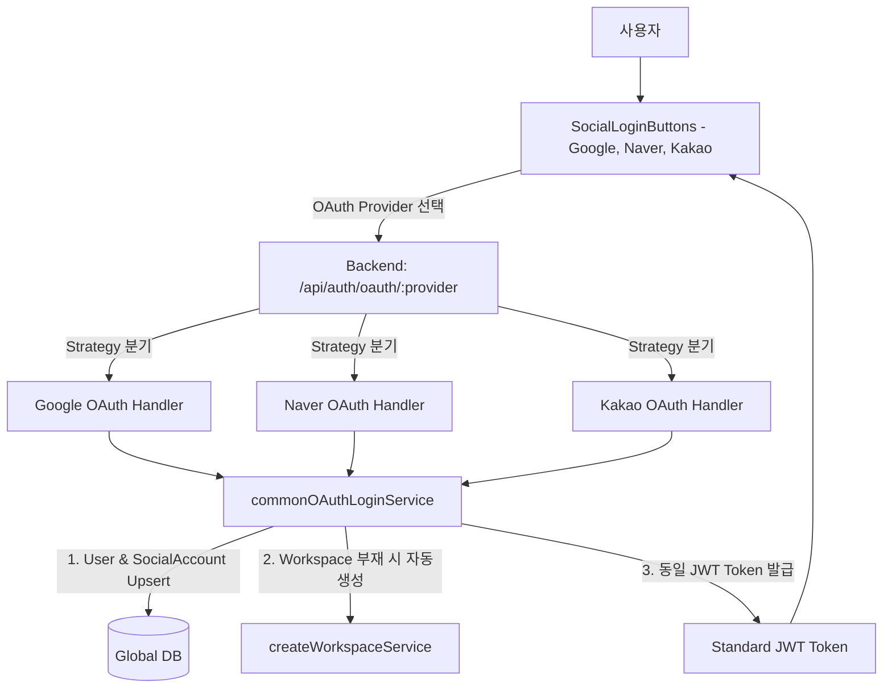

# 🔐 AntiGravity Multi-OAuth Social Login & Auto-Provisioning Specification (범용 소셜 OAuth 및 자동 가입 사양서)

## 1. 기획 개요 및 핵심 원칙
- **목적**: 사용자의 개인 전용 업무 및 외부 친구/동료들이 비밀번호 입력 없이 원클릭으로 간편 가입/로그인하고, 기본 워크스페이스를 자동 생성하여 즉시 협업을 시작할 수 있도록 지원합니다.
- **4대 핵심 원칙**:
  1. **소셜 로그인 시 자동 회원가입**:
     - 별도 가입 폼 없이 OAuth Provider에서 인증 완료 시 즉시 User 및 SocialAccount 생성.
     - **비밀번호(password)는 `null`**로 저장되며, 이메일은 OAuth 인증된 이메일로 고정.
     - 이렇게 가입된 소셜 계정은 **반드시 소셜 로그인을 통해서만 접속 가능** (일반 비밀번호 로그인 시도 시 차단 안내).
  2. **일관된 JWT 세션 유지**:
     - 일반 로그인과 동일한 규격의 JWT Access Token이 발급되어, 별도 추가 인증 없이 모든 백엔드/프론트엔드 기능 이용.
  3. **가입 즉시 기본 Workspace 자동 프로비저닝**:
     - 첫 소셜 로그인 완료 시 `{User.name}'s Personal Workspace`가 자동 생성되어 즉시 대시보드 진입.
  4. **Multi-OAuth 확장 구조 (Google, Naver, Kakao)**:
     - Google 전용 하드코딩을 배제하고, 공통 OAuth Strategy 패턴 기반으로 설계하여 Naver, Kakao, GitHub 등 확장이 용이한 구조 구축.

---

## 2. 범용 Multi-OAuth 아키텍처



---

## 3. 데이터 모델 사양 (`schema.global.prisma`)

```prisma
model User {
  id           Int       @id @default(autoincrement())
  email        String    @unique
  name         String?
  password     String?   // 🔒 소셜 가입자는 null -> 일반 패스워드 로그인 불가
  isEmailVerified Boolean @default(false) // 소셜 가입자는 자동으로 true
  role         String    @default("MEMBER")
  avatar       String?
  avatarColor  String?
  preferences  String?   @default("{}")

  socialAccounts SocialAccount[]
  workspaces     UserWorkspace[]
  ownedWorkspaces Workspace[]    @relation("WorkspaceOwner")
  createdAt    DateTime  @default(now())
  updatedAt    DateTime  @updatedAt
}

model SocialAccount {
  id           Int       @id @default(autoincrement())
  provider     String    // 'GOOGLE' | 'NAVER' | 'KAKAO' | 'GITHUB'
  providerId   String    // Provider 고유 식별자 (sub, id)
  email        String?
  accessToken  String?
  refreshToken String?   // Google Calendar 등 외부 API 연동용
  tokenExpiry  DateTime?

  userId       Int
  user         User      @relation(fields: [userId], references: [id], onDelete: Cascade)
  createdAt    DateTime  @default(now())
  updatedAt    DateTime  @updatedAt

  @@unique([provider, providerId])
}
```

---

## 4. 백엔드 서비스 및 보안 규칙

1. **소셜 계정 비밀번호 로그인 차단 로직**:
   - `emailLogin.service.ts`: 입력된 email의 유저를 조회했을 때 `user.password === null`이면 `400 Bad Request` 반환:
     - 에러 메시지: *"해당 계정은 Google(또는 소셜) 간편 로그인으로 가입된 계정입니다. 소셜 로그인을 이용해주세요."*
2. **OAuth Provider별 파싱 어댑터 (`oauthAdapter.ts`)**:
   - `GOOGLE`: `userinfo.sub`, `userinfo.email`, `userinfo.name`, `userinfo.picture`
   - `NAVER`: `response.id`, `response.email`, `response.name`, `response.profile_image`
   - `KAKAO`: `id`, `kakao_account.email`, `properties.nickname`, `properties.profile_image`
3. **통합 로그인/가입 서비스 (`commonOAuthLogin.service.ts`)**:
   - 추출된 표준 소셜 프로필(`email`, `name`, `provider`, `providerId`, `tokens`)을 바탕으로 유저 Upsert ➔ SocialAccount 연동 ➔ 기본 워크스페이스 점검 및 생성 ➔ JWT 발급.
