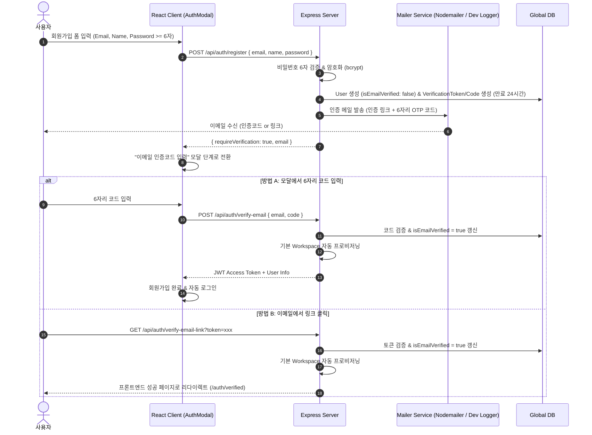

# ✉️ AntiGravity Email Verification & Password Policy Specification (이메일 인증 및 비밀번호 정책 사양서)

## 1. 기획 개요 및 배경
- **목적**:
  1. 일반 이메일 회원가입 시 실제 소유한 이메일인지 검증하여 허위 가입 및 스팸 방지.
  2. 비밀번호 최소 길이(6자) 제한을 도입하여 계정 보안성 강화.
- **적용 대상**: 일반 이메일/비밀번호 가입 사용자 (Google/OAuth 소셜 로그인 사용자는 Provider 자체 인증으로 이메일 검증 스킵).

---

## 2. 이메일 인증 절차 및 아키텍처

웹 표준 이메일 인증 UX 패턴을 분석하여 **"6자리 인증코드(OTP) + 매직 인증 링크"** 하이브리드 방식을 적용합니다.

---

## 3. 세부 기능 요구사항 (Functional Requirements)

### 3.1 비밀번호 정책 (Password Validation)
- **최소 길이 제한**: **최소 6자 이상** (6 to 100 characters).
- **검증 규칙**:
  - 프론트엔드: 입력 즉시 6자 미만인 경우 *"비밀번호는 최소 6자 이상이어야 합니다."* 인라인 경고 표시 및 제출 버튼 비활성화.
  - 백엔드 DTO: `if (!password || password.length < 6) throw new Error('Password must be at least 6 characters long');`

### 3.2 이메일 인증 토큰 및 만료 정책
1. **토큰 및 코드 사양**:
   - `verificationToken`: 64자리 무작위 암호화 16진수 문자열 (Magic Link용).
   - `verificationCode`: 6자리 난수 숫자 (예: `849203`, 모달 직접 입력용).
   - **유효 시간**: 발송 후 **24시간**.
2. **재발송(Resend) 제한**:
   - 스팸 방지를 위해 재발송 버튼 클릭 시 60초 쿨다운(Cooldown) 타이머 적용.

### 3.3 메일러 서비스 환경 (`#lib/mailer.ts`)
- **개발(Development) 환경**:
  - 외부 SMTP 없이 터미널 콘솔에 미려한 ASCII 박스로 인증 URL 및 6자리 코드 즉시 출력하여 개발 편의성 극대화.
- **운영(Production) 환경**:
  - SMTP 설정(Gmail, AWS SES, Resend 등) 환경변수가 존재할 경우 HTML 템플릿 이메일 실발송.

---

## 4. 백엔드/프론트엔드 산출물 목록

- **API 스펙 문서**: [`docs/api/auth/verify-email.md`](file:///C:/Users/admin/antigravity-workflow/docs/api/auth/verify-email.md), [`register.md`](file:///C:/Users/admin/antigravity-workflow/docs/api/auth/register.md)
- **프론트 컴포넌트**: `AuthModal.tsx` (비밀번호 6자 인라인 검증 & OTP 인증코드 입력 스텝 추가)
- **백엔드 서비스**: `register.service.ts`, `verifyEmail.service.ts`, `resendVerification.service.ts`
- **단위 테스트**: `src/tests/auth.verifyEmail.test.ts`, `src/tests/auth.passwordPolicy.test.ts`
