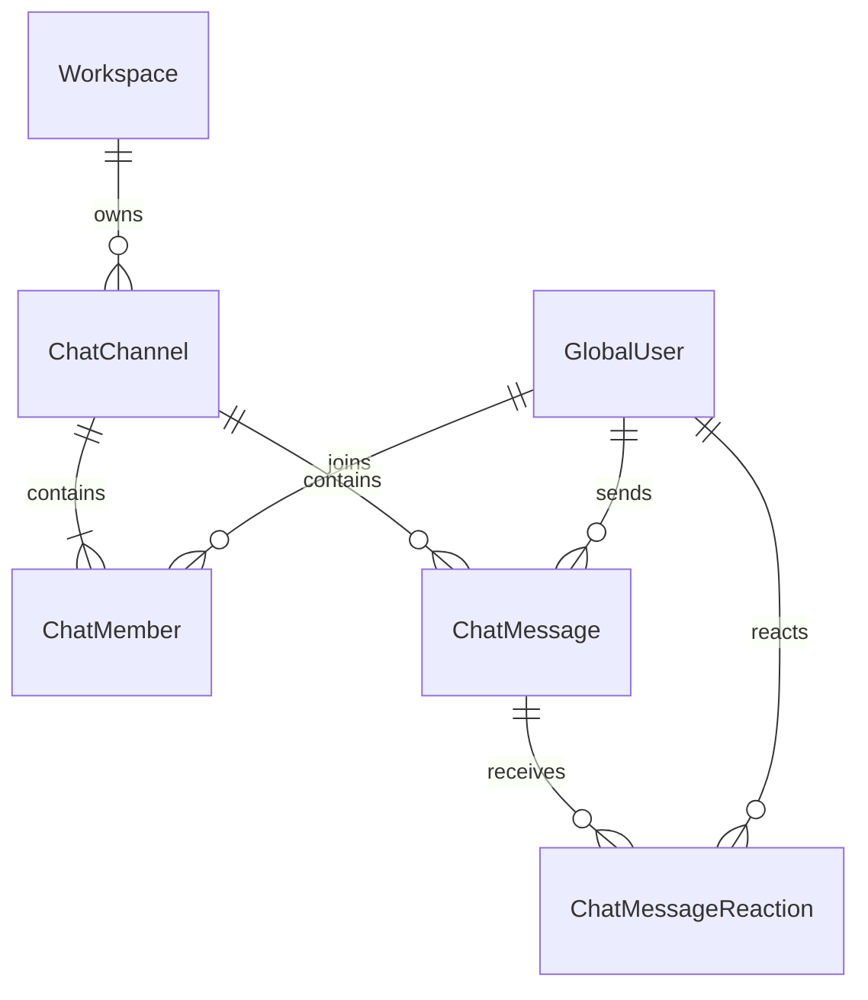

# 💬 AntiGravity Hybrid Chat System Architecture Specification

본 문서는 **전역 1:1 다이렉트 메시지(DM)**와 **워크스페이스 종속 채널(전체 공지/공유, 프로젝트, 그룹)**을 결합한 하이브리드 채팅 시스템의 데이터베이스 모델 및 서비스 설계를 정의합니다.

---

## 1. 핵심 아키텍처 원칙

1. **중앙 집중형 Global DB 기반 메타 태깅 모델**:
   - 모든 채팅 데이터(`ChatChannel`, `ChatMessage`, `ChatMember`, `ChatMessageReaction`)는 중앙 `Global DB`에서 일원화 관리됩니다.
   - 단일 Socket.IO 커넥션으로 워크스페이스 전환 시에도 끊김 없이 실시간 메시지 및 전역 1:1 DM 알림을 수신합니다.
2. **채널 스코프 및 종속성 규칙**:
   - **`DM` (1:1 다이렉트 메시지)**: `workspaceId = null` (계정 중심, 워크스페이스와 무관하게 영구 유지).
   - **`GENERAL` (워크스페이스 전체 채널)**: `workspaceId = X` (해당 워크스페이스에 속한 모든 인원의 공지 및 업무 공유 공간).
   - **`PROJECT` (프로젝트 채널)**: `workspaceId = X, projectId = Y` (해당 프로젝트 참여자 전용).
   - **`GROUP` (그룹/부서 채널)**: `workspaceId = X, groupId = Z` (해당 팀/부서 참여자 전용).

---

## 2. Global Database ERD

---

## 3. 백엔드 서브 서비스 구성 ([`workflow_server/src/modules/chat/services/`](file:///C:/Users/admin/antigravity-workflow/workflow_server/src/modules/chat/services/))

- `getChannels.service.ts`: DM(전역) + 현재 활성 워크스페이스 종속 채널(전체/프로젝트/그룹)을 조합 조회 및 자동 프로비저닝.
- `sendMessage.service.ts`: 메시지 저장, `@멘션` 파싱 및 채널 룸 실시간 브로드캐스트(`broadcastToChannel`).
- `getMessages.service.ts`: 커서 기반 페이지네이션 메시지 히스토리 조회.
- `toggleReaction.service.ts`: 이모지 리액션 토글 및 이모지별 카운트 집계 브로드캐스트.
- `markAsRead.service.ts`: 채널별 마지막 읽은 시간(`lastReadAt`) 갱신.
- `createChannel.service.ts`: 1:1 DM 자동 중복 방지 생성 및 워크스페이스 신규 채널 생성.
