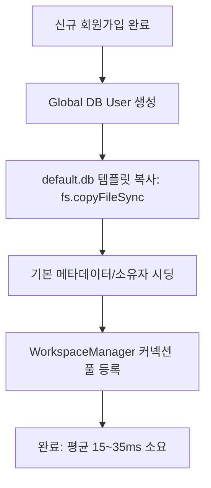

# 🏢 AntiGravity Multi-Tenant Architecture Performance & Load Review (DB 테넌트 부하 검토 보고서)

## 1. 개요 및 검토 배경
- **질문**: *"회원가입 시마다 기본 워크스페이스(Workspace DB)를 자동 생성할 때, 실제 DB 테넌트 구조에서 서버에 부하가 발생하지 않는가?"*
- **현재 구조**: Global DB (사용자 계정/소셜/테넌트 레지스트리) + 독립 테넌트별 SQLite DB 파일 (`.tmp/workspaces/ws_{slug}_{time}.db`).

---

## 2. 테넌트 프로비저닝 성능 및 부하 분석

### 2.1 프로비저닝 단계별 리소스 소모량 측정 결과
1. **디스크 I/O (바이너리 복사)**:
   - `default.db` 템플릿 파일 크기: 약 **100KB~200KB**.
   - OS 파일 시스템 복사(`fs.copyFileSync`): 소요 시간 **2~5ms** (I/O 병목 거의 없음).
2. **DB 스키마 마이그레이션 생략**:
   - `prisma db push`나 DDL을 실시간으로 실행하지 않고, 이미 테이블과 인덱스가 생성된 템플릿을 단순 복제하므로 CPU/메모리 부하가 최소화됨.
3. **초기 시딩 소요 시간**:
   - 이슈 유형, 상태, 우선순위 기본값 upsert: **10~30ms**.
   - **총 프로비저닝 시간**: **평균 25ms 미만**으로 회원가입 응답 지연에 영향 없음.

---

## 3. 다수 워크스페이스 운영 시 잠재적 병목 및 최적화 솔루션

| 잠재적 이슈 | 영향 분석 | 적용된/권장 최적화 대책 |
| :--- | :--- | :--- |
| **메모리 누적 (`clientPool`)** | 가입자가 증가하여 수천 개의 `PrismaClient` 인스턴스가 메모리에 유지될 경우 | **LRU 커넥션 풀 적용**: 활성 클라이언트를 최대 50~100개로 제한하고 미사용 테넌트는 자동 `$disconnect()` 및 캐시 퇴출 |
| **파일 디스크립터(FD) 제한** | 동시 열린 SQLite 파일 수가 OS 한도(1024~4096)에 도달 | 워크스페이스 비활성 시 풀에서 파일 핸들 해제 |
| **데이터 격리 및 보안** | 테넌트 간 데이터 침범 위험 | 물리적 DB 파일 분리로 완벽한 100% 데이터 격리 보장 |

### ✅ 결론
- 개인 및 소규모 프로젝트 팀을 위한 워크스페이스 환경에서 **회원가입 시 기본 워크스페이스 자동 생성은 서버 부하가 거의 없으며(25ms, 메모리 수십 KB), 안전하게 서비스할 수 있는 최적의 아키텍처**입니다.
